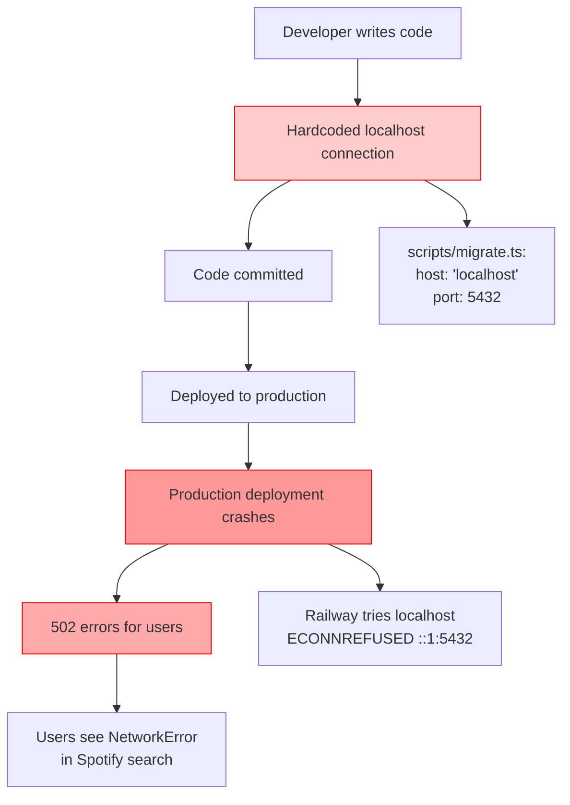
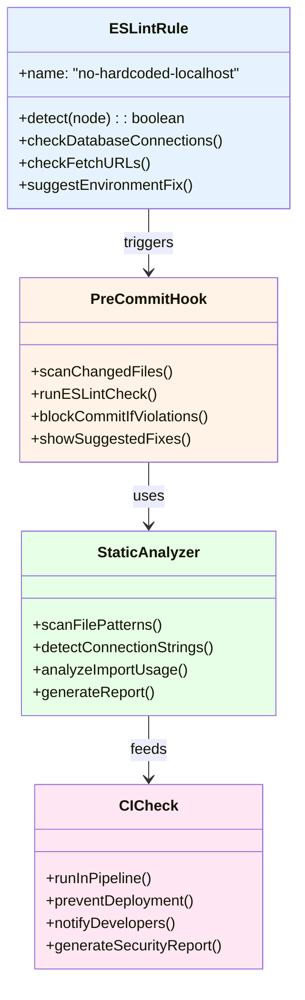
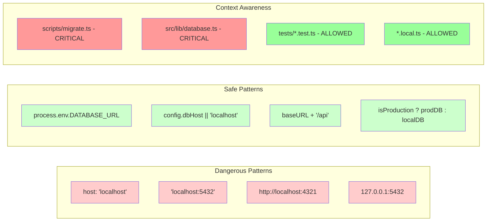
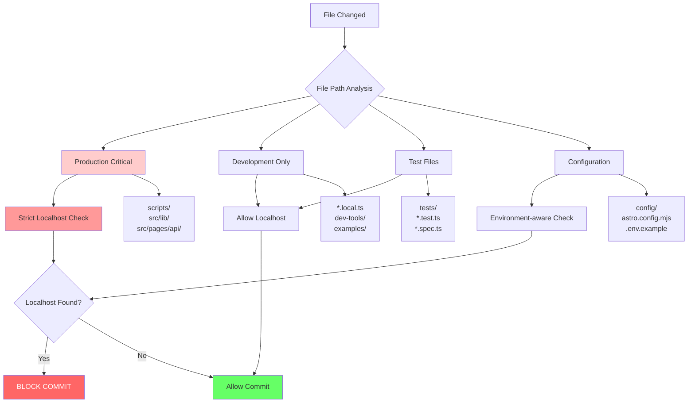

# Localhost Detection Automation - Diagrams

## Problem Flow (Current Issue)



## Solution Flow (With Automation)

```mermaid
flowchart TD
    A[Developer writes code] --> B{Contains localhost?}
    B -->|Yes| C[ESLint Rule Triggers]
    B -->|No| D[Code passes checks]
    
    C --> E[Pre-commit Hook Blocks]
    E --> F[Clear error message]
    F --> G[Suggested environment fix]
    G --> H[Developer fixes code]
    H --> A
    
    D --> I[Code committed safely]
    I --> J[Deployment succeeds]
    J --> K[Production works correctly]
    
    style C fill:#fff2cc,stroke:#d6b656
    style E fill:#ffcccc,stroke:#ff0000
    style F fill:#ffe6cc,stroke:#ff9900
    style G fill:#e6f3ff,stroke:#0066cc
    style I fill:#ccffcc,stroke:#00aa00
    style J fill:#ccffcc,stroke:#00aa00
    style K fill:#90EE90,stroke:#006400
```



## Detection Mechanisms



## Pattern Detection Examples



## File Classification System



## Integration Workflow

```mermaid
sequenceDiagram
    participant D as Developer
    participant E as ESLint
    participant H as Git Hook
    participant C as CI/CD
    participant P as Production
    
    D->>E: Code with localhost
    E->>E: Rule detects violation
    E->>D: Error with suggestion
    D->>D: Fix environment usage
    D->>H: Attempt commit
    H->>H: Scan changed files
    H->>H: Run ESLint checks
    H->>C: Commit passes
    C->>C: Final deployment check
    C->>P: Deploy safely
    
    Note over E,H: Multiple layers of<br/>prevention
    Note over C,P: Production protected<br/>from localhost issues
    
    style E fill:#e6f3ff
    style H fill:#fff2e6
    style C fill:#e6ffe6
    style P fill:#ccffcc
```