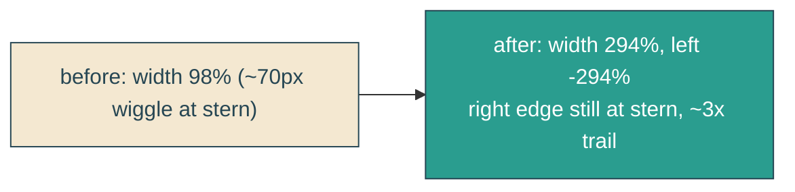

# longer-wake

## Verbatim request (2026-06-15)

> can the line attached to the boat be 3x longer?
> [confirmed: 3x longer trailing behind the stern, right end pinned to the boat]

## Confirmed understanding

Make the boat-wake (`.reveal-echo`) line about 3x longer horizontally so it trails
farther back behind the stern (a longer, shallower wake). Its right end stays pinned at
the boat's back edge; height unchanged.

## Mechanism

`.reveal-echo` is anchored against `.envelope-track` with `left: -98%; width: 98%`, so
its right edge sits at the track's left edge (the stern) and the whip wave (the right
~23% of its `viewBox`, stretched by `preserveAspectRatio="none"`) is the visible wake.
Tripling the box width to `294%` (with `left: -294%`) keeps the right edge at the stern
and stretches the wave ~3x leftward into a longer trailing wake. `height` stays `48px`.

## Out of scope

Stern pin, waterline anchor, the morph wiggle, stroke style, the reveal clip. Only the
wake's horizontal length changes.

## Validation

To validate longer-wake I can screenshot the hero mid-sail and confirm the wake trails
visibly farther behind the stern; assert in e2e that the wake line is now noticeably
wider and still pinned at the boat's left edge with no page scroll; canary pins the
`width: 294%` rule.
