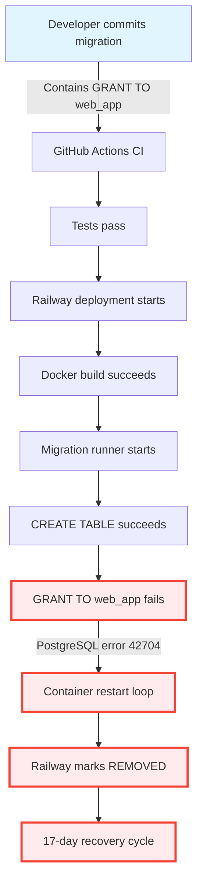
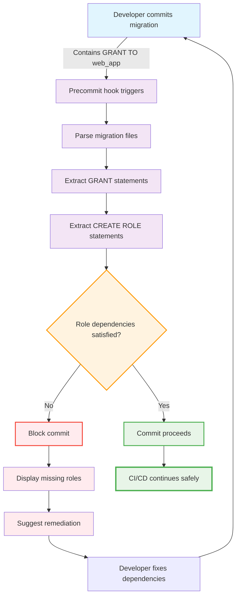
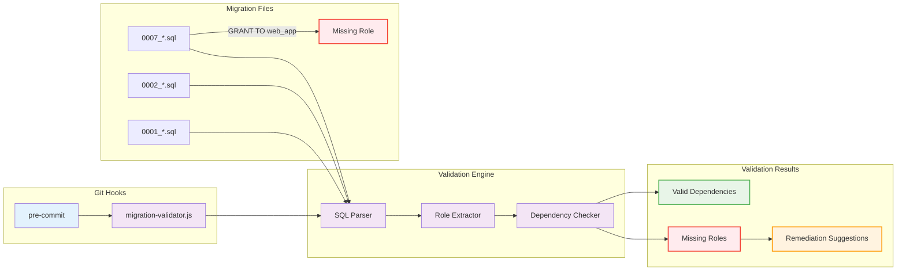
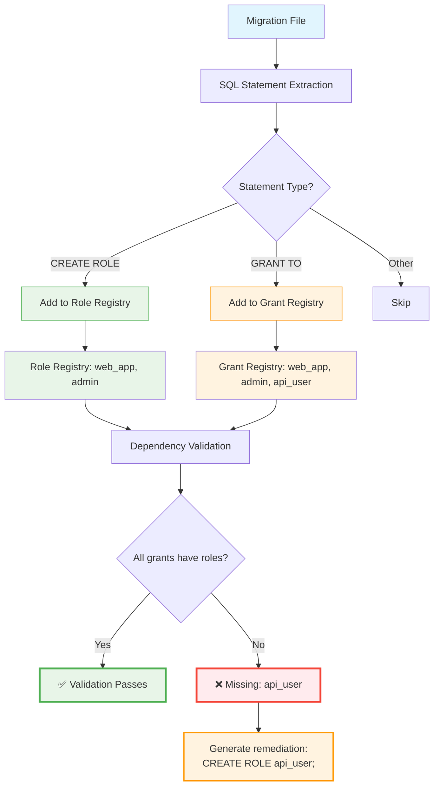

# Migration Dependency Validation Diagrams

## Current Failure Flow

```mermaid
graph TD
    A[Developer commits migration] -->|Contains GRANT TO web_app| B[GitHub Actions CI]
    B --> C[Tests pass]
    C --> D[Railway deployment starts]
    D --> E[Docker build succeeds]
    E --> F[Migration runner starts]
    F --> G[CREATE TABLE succeeds]
    G --> H[GRANT TO web_app fails]
    H -->|PostgreSQL error 42704| I[Container restart loop]
    I --> J[Railway marks REMOVED]
    J --> K[17-day recovery cycle]
    
    style A fill:#e1f5fe
    style H fill:#ffebee,stroke:#f44336,stroke-width:3px
    style I fill:#ffebee,stroke:#f44336,stroke-width:3px
    style J fill:#ffebee,stroke:#f44336,stroke-width:3px
    style K fill:#ffebee,stroke:#f44336,stroke-width:3px
```

## Proposed Prevention Flow

```mermaid
graph TD
    A[Developer commits migration] -->|Contains GRANT TO web_app| B[Precommit hook triggers]
    B --> C[Parse migration files]
    C --> D[Extract GRANT statements]
    D --> E[Extract CREATE ROLE statements]
    E --> F{Role dependencies satisfied?}
    F -->|Yes| G[Commit proceeds]
    F -->|No| H[Block commit]
    H --> I[Display missing roles]
    I --> J[Suggest remediation]
    G --> K[CI/CD continues safely]
    J --> L[Developer fixes dependencies]
    L --> A
    
    style A fill:#e1f5fe
    style B fill:#f3e5f5
    style C fill:#f3e5f5  
    style D fill:#f3e5f5
    style E fill:#f3e5f5
    style F fill:#fff3e0,stroke:#ff9800,stroke-width:2px
    style G fill:#e8f5e8,stroke:#4caf50,stroke-width:2px
    style H fill:#ffebee,stroke:#f44336,stroke-width:2px
    style I fill:#ffebee
    style J fill:#ffebee
    style K fill:#e8f5e8,stroke:#4caf50,stroke-width:3px
```

## Technical Architecture

```mermaid
graph LR
    subgraph "Git Hooks"
        A[pre-commit] --> B[migration-validator.js]
    end
    
    subgraph "Validation Engine"
        B --> C[SQL Parser]
        C --> D[Role Extractor]
        D --> E[Dependency Checker]
    end
    
    subgraph "Migration Files"
        F[0001_*.sql] 
        G[0002_*.sql]
        H[0007_*.sql]
        H -->|GRANT TO web_app| I[Missing Role]
    end
    
    subgraph "Validation Results"
        E --> J[Valid Dependencies]
        E --> K[Missing Roles]
        K --> L[Remediation Suggestions]
    end
    
    F --> C
    G --> C  
    H --> C
    
    style A fill:#e3f2fd
    style B fill:#f3e5f5
    style C fill:#f3e5f5
    style D fill:#f3e5f5
    style E fill:#f3e5f5
    style I fill:#ffebee,stroke:#f44336,stroke-width:2px
    style J fill:#e8f5e8,stroke:#4caf50,stroke-width:2px
    style K fill:#ffebee,stroke:#f44336,stroke-width:2px
    style L fill:#fff3e0,stroke:#ff9800,stroke-width:2px
```

## Role Dependency Detection

```mermaid
graph TD
    A[Migration File] --> B[SQL Statement Extraction]
    B --> C{Statement Type?}
    
    C -->|CREATE ROLE| D[Add to Role Registry]
    C -->|GRANT TO| E[Add to Grant Registry]
    C -->|Other| F[Skip]
    
    D --> G[Role Registry: web_app, admin]
    E --> H[Grant Registry: web_app, admin, api_user]
    
    G --> I[Dependency Validation]
    H --> I
    
    I --> J{All grants have roles?}
    J -->|Yes| K[✅ Validation Passes]
    J -->|No| L[❌ Missing: api_user]
    
    L --> M[Generate remediation:<br/>CREATE ROLE api_user;]
    
    style A fill:#e1f5fe
    style D fill:#e8f5e8,stroke:#4caf50
    style E fill:#fff3e0,stroke:#ff9800  
    style G fill:#e8f5e8
    style H fill:#fff3e0
    style K fill:#e8f5e8,stroke:#4caf50,stroke-width:3px
    style L fill:#ffebee,stroke:#f44336,stroke-width:3px
    style M fill:#fff3e0,stroke:#ff9800,stroke-width:2px
```