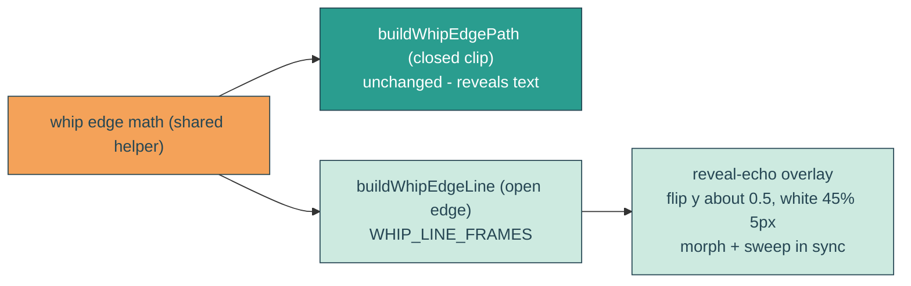

# mirrored-reveal-echo

## Verbatim request (2026-06-14)

> can we mirror the reveal lines across the x axis as another set except the lines
> don't reveal anything but the do have semi transparent white thickness to it
> [confirmed: animate in sync with the reveal; medium look ~5px ~45% white]

## Confirmed understanding

Add a second wave that is the reveal wave edge (the whip line) mirrored vertically
(reflected across the x-axis). It does NOT clip or reveal anything; it is drawn as a
visible semi-transparent white stroke (~5px, ~45% opacity) over the headline band, and
it animates in sync with the reveal (the same morph wobble and the same left-to-right
sweep, 5.333s). A decorative mirrored echo of the reveal wave.

## Mechanism

- `heroScene.ts`: factor the whip edge math into a shared helper; keep
  `buildWhipEdgePath` (the closed clip) byte-identical, and add `buildWhipEdgeLine`
  returning just the open wavy edge (`M head <cubics>`, no box, no Z).
  `WHIP_LINE_FRAMES` mirrors `WHIP_EDGE_FRAMES` (same centers).
- `HeroBay.astro`: inside `.headline-mask`, add an overlay
  `<svg class="reveal-echo" viewBox="0 0 1 1" preserveAspectRatio="none">` with a
  group flipped about y=0.5 (`translate(0 1) scale(1 -1)`) holding a `reveal-echo-line`
  path. The path animates its `d` through `WHIP_LINE_FRAMES` (morph, 3.333s loop) and a
  `translate` sweep reusing the reveal's `REVEAL_EDGE` values/keyTimes (5.333s).
- `yait.css`: `.reveal-echo` fills the headline box (absolute, pointer-events none);
  `.reveal-echo-line` is `fill: none; stroke: #fff; stroke-opacity: 0.45;
  stroke-width: 5px; vector-effect: non-scaling-stroke` (px stroke despite the 0..1
  viewBox).

## Reduced motion

The echo's morph/sweep are SMIL, stripped by `home.astro` under reduced motion, so the
echo rests as a static mirrored line (no motion), consistent with the reveal.

## Out of scope

The reveal itself (unchanged), text, clouds, sky. This only adds the decorative
mirrored white line.

## Validation

To validate mirrored-reveal-echo I can CURL `/home` for the `reveal-echo` svg, the
`reveal-echo-line` path with the y-flip transform, and its morph + sweep animates;
confirm the stroke is white at ~0.45 opacity ~5px (canary on CSS); screenshot the
headline band and confirm a semi-transparent white wavy line sits mirrored below/around
the reveal edge and travels in sync; confirm it reveals nothing (fill none) and rests
under reduced motion.
