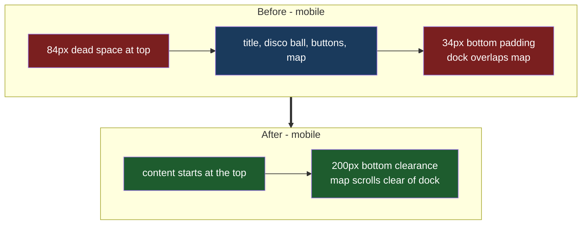

# Mobile Top Flow

## Understanding

On mobile the page flow starts 84px down (34px main top padding plus a 50px stripe-panel
margin), and — the deeper cause of the dock crowding the map — the mobile media block
overrides main's bottom padding to 34px, wiping out the 30vh dock clearance that desktop
gets. The fixed RSVP'd-cards dock then overlaps the map on shorter phones.

Mobile-only changes: the flow starts at the top of the screen (zero top padding/margin),
and main gets real bottom clearance sized to the mobile dock so the map scrolls clear.

## Outcome

- Mobile: first content at the viewport top; the page can scroll until the map sits fully
  above the dock. Desktop untouched.
- E2E locks the top-start measurement at a mobile viewport.
- Deployed to production once verified locally.
