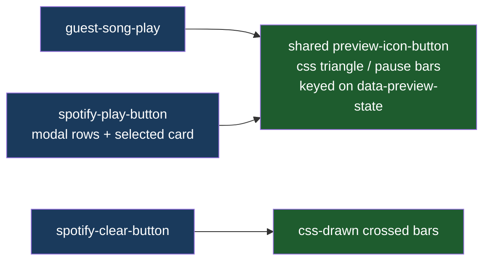

# Modal Icon Polish

## Understanding

The RSVP modal's play/pause buttons (dropdown rows and the selected card) still render
font glyphs, which center differently per device — the exact problem solved on the guest
cards with CSS-drawn icons. The modal's (x) clear button is also a text character. Both get
the geometry-drawn treatment so every audio control on the site looks identical and
perfectly centered.

## Approach: one shared rule set

The triangle/pause-bars drawing moves from the guest-card rules into a shared
`preview-icon-button` class in `global.css`, applied by both the guest-list renderer and
the combobox row renderer; the guest-specific rules keep only sizing/color/hover. The
`AudioPreviewManager` already maintains `data-preview-state` on every button it touches, so
the modal buttons switch icons with zero behavior change (the glyph text stays in the DOM,
transparent, because the playback state machine keys off it). The clear X is drawn with two
crossed bars on the existing `.spotify-clear-button`.

## Outcome

- Identical, font-independent play/pause icons in the dropdown, selected card, and guest
  cards (em-sized, so each button's scale is preserved); a crisp drawn X on clear.
- No duplicated icon rules: the guest-card copies are replaced by the shared class.
- Markup wiring locked by unit tests; visuals verified by high-zoom screenshots of all
  surfaces; behavior suites unchanged.
- Deployed to production once verified locally.
