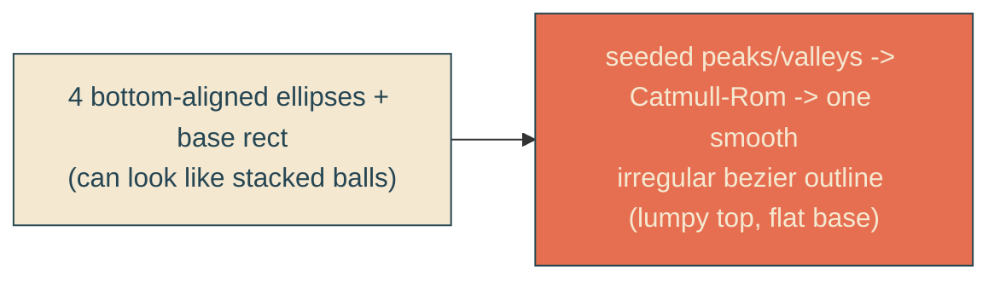

# natural-cloud-shapes

## Verbatim request (2026-06-13)

> can we look into more natural cloud shapes?
> [chosen: build it now]

## Confirmed understanding

The current clouds are stacked ellipses, which can read as a row of separate balls.
Replace that with one smooth, irregular organic silhouette per cloud - a lumpy top of
unequal soft bumps over a flat base, drawn as a single smoothed bezier outline - so
each cloud reads as one natural puff. Keep everything else: the cream-to-coral
gradient, the rim-glow pulse, the drift/bob/breathe, and the far parallax plane.

## Mechanism

`buildCloud` is reworked: instead of returning ellipses + a base rect, it builds a
seeded set of perimeter points (bottom-left corner, then alternating valleys and
unequal peaks across the top with a sine height envelope and jitter, then bottom-right
corner) and smooths them into a single closed cubic-bezier `<path>` via Catmull-Rom,
with a flat bottom. One path per cloud, filled by the existing vertical gradient.

## Validation

To validate natural-cloud-shapes I can screenshot the sky and confirm the clouds read
as single soft irregular puffs (not rows of balls), with the two-tone gradient, glow,
and motion intact; the unit test asserts a closed smooth path with a flat base and
irregular lumps above it.

## Out of scope

Gradient/colour, rim-glow pulse, drift/bob/breathe, far plane, sun/sea/headline.
Only the cloud silhouette generator and the per-cloud markup (path vs ellipses) change.
