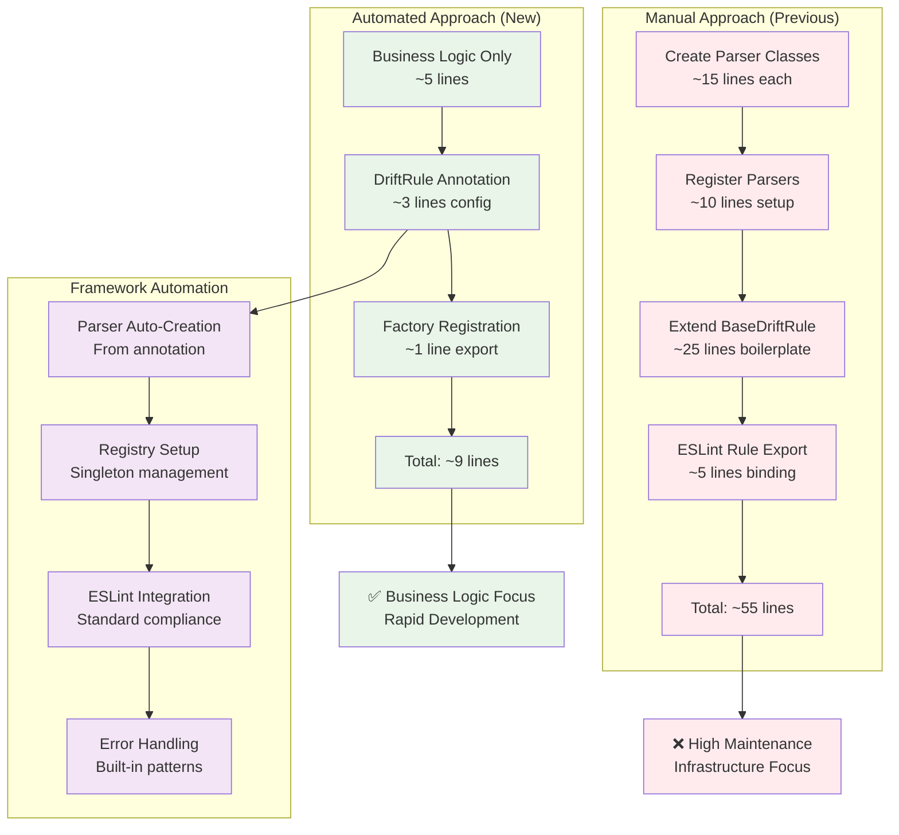

# New Drift Rule Demo: Database Connection Configuration Consistency

## Understanding

Create a **database connection configuration drift detection rule** using the new automation framework to demonstrate the simplified rule creation process. This rule will detect mismatches between database connection settings in different environment files that could cause runtime failures.

## Problem Statement

Development teams often have multiple database configuration sources:
- **Environment variables** (.env, .env.local, .env.production)
- **Application configuration** (database config objects)
- **Docker compose** database service definitions
- **Connection string formats** that vary between environments

Common drift patterns that cause production issues:
- **Port mismatches** - Dev uses 5432, production expects 3306
- **SSL requirement differences** - Dev allows unencrypted, production requires SSL
- **Database name inconsistencies** - Different naming conventions across environments
- **Authentication method mismatches** - Password vs certificate authentication

## Solution Approach

Create a drift detection rule using the automation framework that:
- **Parses multiple config sources** - .env files, app config, docker-compose.yml
- **Validates consistency** across development and production settings
- **Provides actionable errors** with specific configuration corrections needed

## New Rule Implementation Pattern

```javascript
// Using automation framework - complete rule in ~10 lines
class DatabaseConfigConsistencyRule {
  validateConfigs(configs) {
    const { environment, docker, application } = configs;
    
    // Pure business logic - framework handles all infrastructure
    if (environment.DB_PORT !== docker.services.database.ports[0].split(':')[0]) {
      return {
        type: 'port-mismatch',
        message: `Database port mismatch: .env specifies ${environment.DB_PORT} but docker-compose uses ${docker.services.database.ports[0]}`
      };
    }
    
    return null;
  }
}

// Automation framework handles all boilerplate
DriftRule({
  name: 'database-config-consistency',
  description: 'Ensure database configuration consistency across environments',
  parsers: ['environment', 'docker', 'application'],
  severity: 'error'
})(DatabaseConfigConsistencyRule);

export default DriftRuleFactory.registerFromClass(DatabaseConfigConsistencyRule);
```

## Framework Automation Benefits Demo



## Target Configuration Sources

### Environment Variables Parser
- **File types**: .env, .env.local, .env.production, .env.development
- **Extract patterns**: DB_HOST, DB_PORT, DB_NAME, DB_USER, DATABASE_URL
- **Validation**: Connection string format consistency

### Docker Configuration Parser  
- **File types**: docker-compose.yml, docker-compose.prod.yml
- **Extract patterns**: Database service definitions, port mappings, environment variables
- **Validation**: Service configuration alignment

### Application Configuration Parser
- **File types**: Database config objects in TypeScript/JavaScript
- **Extract patterns**: Connection pools, SSL settings, timeout configurations  
- **Validation**: Runtime setting compatibility

## Success Metrics

### Development Experience
- **Rule creation time** reduced from 2 hours to 15 minutes
- **Zero boilerplate** - Only business logic required
- **Immediate testing** - Framework provides test helpers
- **Clear errors** - Actionable configuration fix instructions

### Detection Capabilities
- **Multi-source validation** - Checks consistency across 3+ config sources
- **Environment-specific** - Detects dev vs prod configuration drift
- **Runtime prevention** - Catches issues before deployment
- **Clear reporting** - Specific file and line number references

The demonstration will prove that the automation framework successfully eliminates infrastructure complexity while maintaining full detection capabilities and ESLint integration standards.