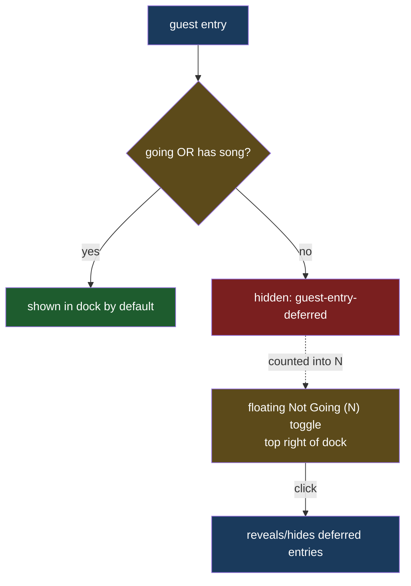

# Not Going Toggle

## Understanding

The bottom dock defaults to showing guests who are going OR who picked a song (a not-going
guest with a song still contributes to the party playlist view). Guests who are not going
and have no song are hidden by default. A small floating "Not Going (N)" button at the top
right of the dock toggles their visibility; it is absent when every guest is shown anyway
(N = 0).

## Design notes

- One predicate, one home: `isDeferredGuest` exported from `GuestListRenderer`, used both
  to tag entries with the `guest-entry-deferred` class and to compute the count the button
  displays — the classification can never drift between render and label.
- Visibility is pure CSS: deferred entries are `display: none` until the dock carries a
  `show-deferred` class toggled by the button (aria-pressed mirrors the state).
- Play all is unaffected: deferred guests have no songs by definition, so the play queue
  never contains hidden buttons.

## Outcome

- Default dock: going and/or song-picking guests only; the floating pill reveals the rest
  on demand and hides them again.
- Locked by renderer unit tests (classification matrix), e2e (hidden by default, count
  label, reveal and re-hide, not-going-with-song visible by default).
- Deployed to production once verified locally.
