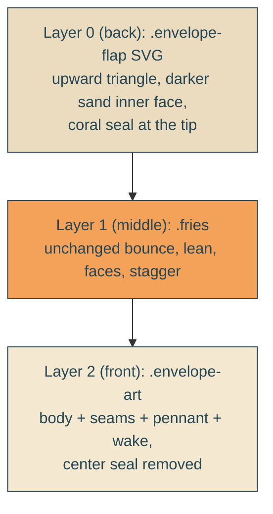

# open-envelope

## Verbatim request (2026-06-12)

> can we look at making it so that the envelope is open with the top flap pointing
> up to the sky and all the little fry people are "inside" the envelope?

## Confirmed understanding

The envelope becomes an opened envelope: the back flap is raised, pointing up at
the sky, with a slightly darker sand inner face and the coral wax seal relocated to
its tip (the broken seal of an opened invitation). The fry people read as standing
inside the mouth — layered between the raised flap behind them and the front panel
in front of them (their bounce, lean, faces, and stagger untouched). The front
panel keeps its fold seams but loses the center seal; the pennant stays.

## Layering at a glance

## Plan

1. `HeroBay.astro`: new `.envelope-flap` inline SVG as the envelope's first child
   (triangle from the body's top corners to an apex pointing up, seal circle near
   the tip); the front `.envelope-art` drops the center seal circle; everything
   else in the scene untouched.
2. `yait.css`: `.envelope-flap` absolutely positioned with its base on the body's
   top edge (bottom 72 percent, spanning the body width), z-index 0 beneath the
   fries' z-index 1 and the front art's z-index 2; static (rides the existing
   envelope bob/settle transforms).
3. Tests (failure-first): integration asserts the served HTML contains the flap
   element and exactly one wax seal (on the flap, none on the front); e2e asserts
   the flap's bounding box sits above the front art's top and behind the fries in
   paint order (z-index probe via computed styles).
4. Frames at both viewports judge the read: flap to the sky, fries inside; verify
   the flap apex does not collide with the second headline line during the sail.
5. Validate locally, deploy with sentinel = prod /home HTML containing
   "envelope-flap", forensics pre/post.

### PR checklist pass

Pure markup and style-rule change (no inline styles beyond established data
binding, no logic, nothing duplicated); no comments; integration and e2e additions
cover the new structure.
