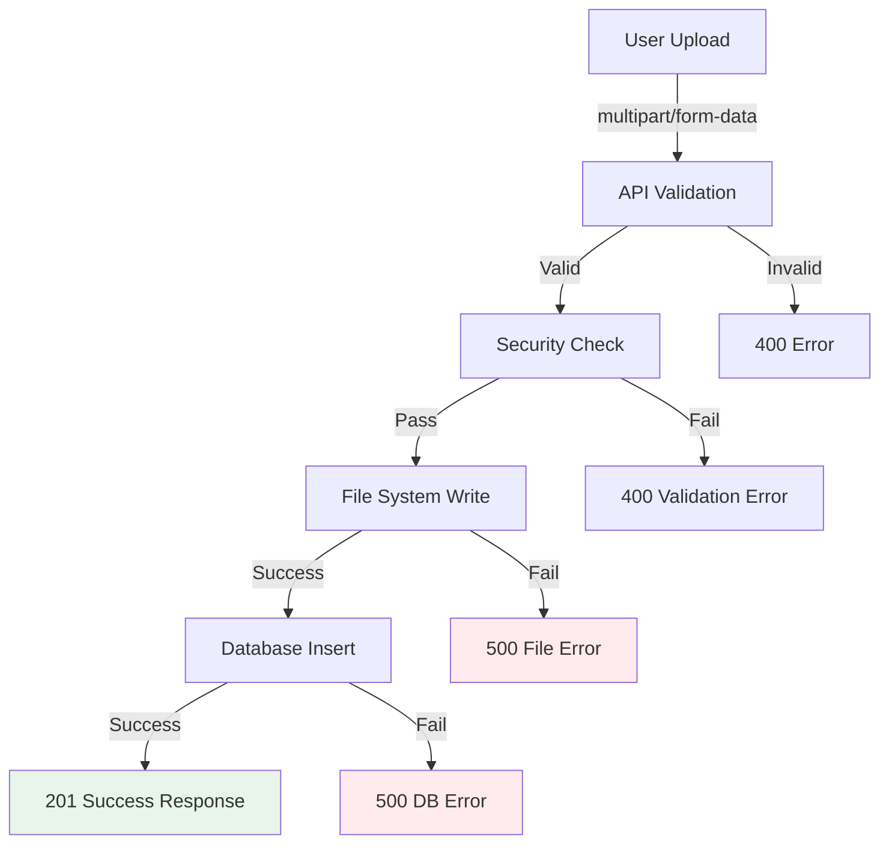

# Overlay Upload Fix

## Problem Statement

Overlay upload functionality is failing with "Internal server error during upload" (HTTP 500) when users try to upload image files. The admin interface shows the error but the root cause is unclear.

## Root Cause Analysis

Several potential issues identified in `/src/pages/api/admin/upload-overlay.ts`:

1. **Import path mismatch**: Code imports `securityValidator.js` but file is `securityValidator.ts`
2. **Database INSERT/RETURN mismatch**: INSERT doesn't provide `blend_mode`/`opacity` values but RETURNING clause expects them
3. **File system permissions**: Writing to `public/overlays` directory may fail
4. **Port confusion**: Dev server running on port 4323, not 4321

## Current Error Pattern

```javascript
// Upload API call fails with:
"Failed to upload flowers.jpg: Error: Internal server error during upload"
// HTTP 500 from /api/admin/upload-overlay
```

## Solution Approach

1. **Fix import paths** to use correct TypeScript extensions
2. **Provide default values** for database columns in INSERT statement
3. **Add better error logging** to identify specific failure points
4. **Test file system permissions** and directory creation
5. **Validate database connection and table structure**

## Success Criteria

- [ ] Users can successfully upload overlay image files
- [ ] Files are properly validated and stored
- [ ] Database records created correctly with all required fields
- [ ] Clear error messages for validation failures
- [ ] No 500 errors for valid upload attempts

## Architecture Impact

**Low risk** - Fixes are isolated to upload endpoint, no changes to admin UI or database schema needed.



## Testing Strategy

- Unit tests for upload validation
- Integration tests for full upload flow
- Error scenario testing (invalid files, permissions, DB failures)
- CURL-based API testing for happy/unhappy paths