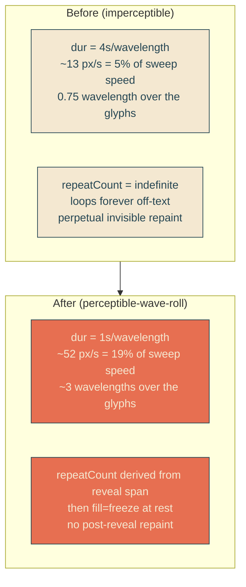
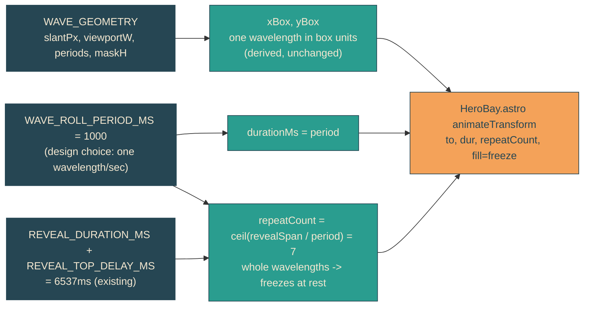

# perceptible-wave-roll

## Verbatim request (2026-06-12)

> let's make the waves rolling in the reveal slants more percievable as if the
> waves are rolling down the slants

## Background (measured in the prior deep dive)

The reveal edges already roll: a SMIL `animateTransform` inside the shared
`#yait-wave-clip` clipPath translates the wave shape one wavelength down the slant
every 4s, seamlessly. But it is imperceptible in practice:

- Crest speed is ~13 px/s along the edge while the reveal sweep crosses the screen
  at ~270 px/s in the same down-right direction. The roll is under 5% of the sweep
  speed, so the eye folds it into the sweep.
- Over the ~3s the edge crosses the glyphs, the wave advances only ~0.75 of a
  wavelength.
- After the reveal completes, the edge parks off the text and the SMIL keeps
  looping forever (`repeatCount="indefinite"`), changing zero visible pixels while
  forcing a perpetual repaint of two full-width clipped layers.

The mechanism is sound; only its speed and lifetime are wrong.

## Confirmed understanding

Make the existing down-the-slant roll clearly visible during the reveal, then stop
it once the text is fully revealed:

1. Speed up the roll to one wavelength per second (~52 px/s, 4x faster), so several
   crests visibly travel down each 45-degree slant while the edge sweeps the text.
   Direction is unchanged (down-right, toward the dock) and already correct.
2. Freeze the roll at rest once the reveal finishes, instead of looping forever.
   Because one wavelength of translation is visually identical to no translation
   (the path carries one-wavelength zero-phase margins on each end), freezing after
   a whole number of wavelengths lands exactly on the rest shape, with no jump.

No new mechanism: same SMIL-on-clipPath, same jitter-free guarantee (text elements
are never transformed). Amplitude stays at 12.5px (the earlier aesthetic retune is
respected). Reduced motion still removes the animation node entirely.

## What changes at a glance

## Why freezing at the end value equals rest

The clip path is generated with `margin = 1/periods` (one full wavelength) of
zero-phase wave beyond each slant end and a half-box enclosure. Translating the
shape by exactly `(slantFrac/periods, 1/periods)` box units shifts the periodic
wave by one wavelength, so the visible edge is shape-identical to the untranslated
edge. After `repeatCount` whole cycles, `fill="freeze"` holds the end transform,
which is therefore visually the rest edge. This is the same seamless-loop property
the indefinite version already depended on; we are only stopping on a seam.

## Out of scope

- Amplitude changes (kept at 12.5px).
- Any change to the reveal sweep timing or the headline lockup.
- Reworking the two-system (CSS sweep + SMIL roll) split; the deep dive noted a
  possible single-animation collapse, but that risks reintroducing the jitter the
  SMIL approach was chosen to prevent, so it is deliberately left alone.
