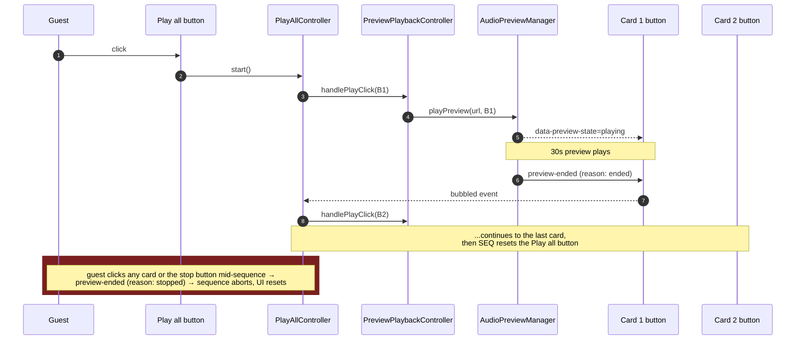
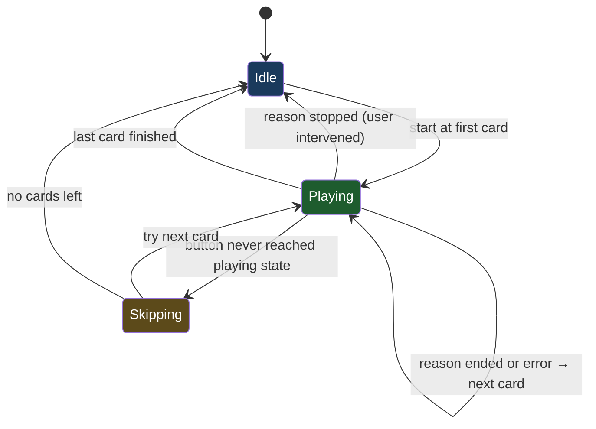
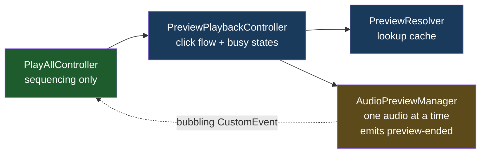

# Play All Previews — Diagrams

## Event-driven sequencing

```mermaid
sequenceDiagram
    autonumber
    participant U as Guest
    participant PA as Play all button
    participant SEQ as PlayAllController
    participant PC as PreviewPlaybackController
    participant AM as AudioPreviewManager
    participant B1 as Card 1 button
    participant B2 as Card 2 button

    U->>PA: click
    PA->>SEQ: start()
    SEQ->>PC: handlePlayClick(B1)
    PC->>AM: playPreview(url, B1)
    AM-->>B1: data-preview-state=playing
    Note over AM,B1: 30s preview plays
    AM->>B1: preview-ended (reason: ended)
    B1-->>SEQ: bubbled event
    SEQ->>PC: handlePlayClick(B2)
    Note over SEQ,B2: ...continues to the last card,<br/>then SEQ resets the Play all button

    rect rgb(122, 31, 31)
        Note over U,SEQ: guest clicks any card or the stop button mid-sequence →<br/>preview-ended (reason: stopped) → sequence aborts, UI resets
    end
```

## Controller state machine

```mermaid
stateDiagram-v2
    classDef idle fill:#1a3a5c,color:#fff
    classDef active fill:#1e5c2e,color:#fff
    classDef skip fill:#5c4a1a,color:#fff

    [*] --> Idle
    Idle --> Playing: start at first card
    Playing --> Playing: reason ended or error → next card
    Playing --> Skipping: button never reached playing state
    Skipping --> Playing: try next card
    Playing --> Idle: reason stopped (user intervened)
    Playing --> Idle: last card finished
    Skipping --> Idle: no cards left

    class Idle idle
    class Playing active
    class Skipping skip
```

## Who owns what (no new global state)

```mermaid
flowchart LR
    PA[PlayAllController<br/>sequencing only] --> PC[PreviewPlaybackController<br/>click flow + busy states]
    PC --> RES[PreviewResolver<br/>lookup cache]
    PC --> AM[AudioPreviewManager<br/>one audio at a time<br/>emits preview-ended]
    AM -. bubbling CustomEvent .-> PA

    style PA fill:#1e5c2e,color:#fff
    style PC fill:#1a3a5c,color:#fff
    style RES fill:#1a3a5c,color:#fff
    style AM fill:#5c4a1a,color:#fff
```
