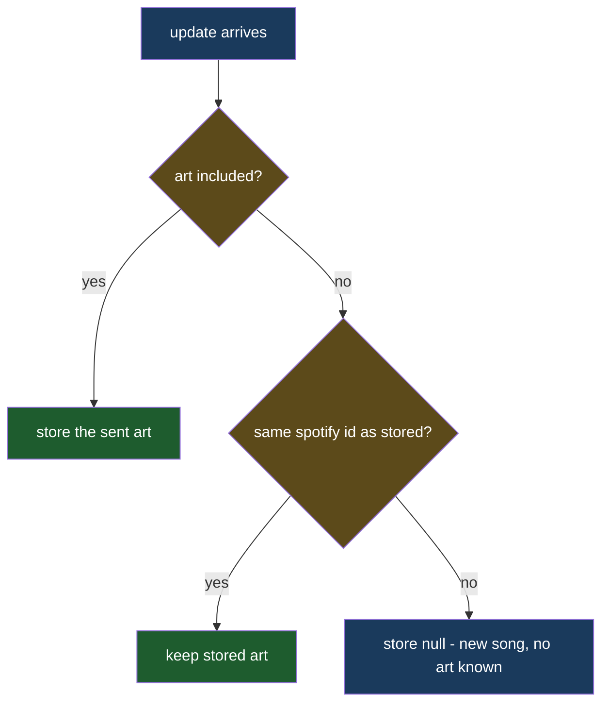

# Preserve Album Art

## Understanding

Resubmitting an RSVP from a device whose saved song predates the album-art feature wipes
the stored art: the client posts the song without `albumArtUrl`, and the RSVP update
overwrites every song column with whatever arrived. Reproduced end to end (art True before
a simulated stale-device attendance switch, None after) and observed live on the
"testing music" row.

The fix makes the server resilient: when the incoming song is the same track
(matching `song_spotify_id`) and carries no art, the stored art survives. A different track
takes exactly what was sent, so stale art can never bleed onto the wrong cover. Explicit
art always wins.

## Outcome

- Same-track resubmits (attendance flips, message edits) keep the art regardless of how
  stale the client's saved song is; no client change needed.
- Locked by an integration test that seeds art, resubmits the same track without art, and
  asserts the art survives — plus the different-track replacement case.
- The wiped art on the production "testing music" row is backfilled after deploy.
