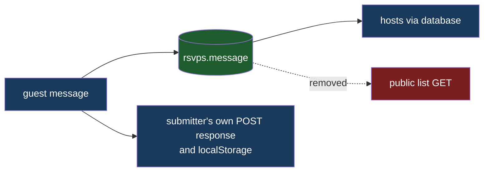

# Private RSVP Message

## Understanding

The RSVP message field becomes an explicitly private channel to the hosts:

1. The textarea placeholder changes from "A brief message (optional)" to
   "Additional message (any food allergies or questions?)".
2. Messages keep being stored and are still echoed back to the submitter in their own
   submission response, but they are removed from the public guest-list API response. The
   main page never rendered them, but `GET /api/rsvp` returned every guest's message to any
   caller - about to be allergy and personal info, so the leak closes at the API.

## Outcome

- Inviting allergy/questions prompt on the form; messages reach the database and only the
  database (plus the submitter's own device).
- The public list payload contains no `message` key at all - locked by an integration test
  and the list-payload canary.
- Deployed to production once verified locally.
