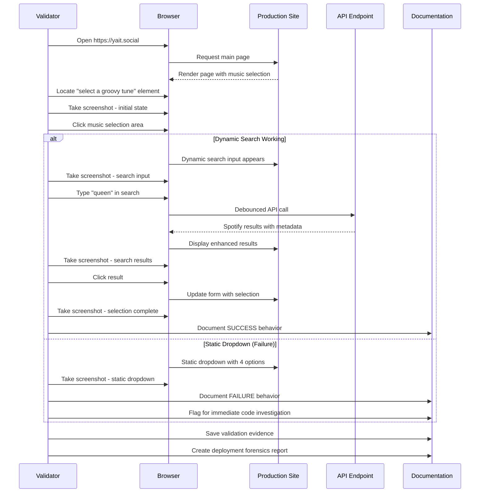
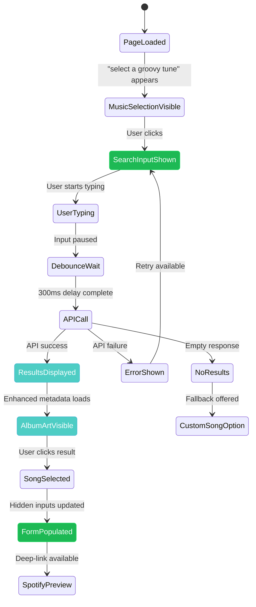
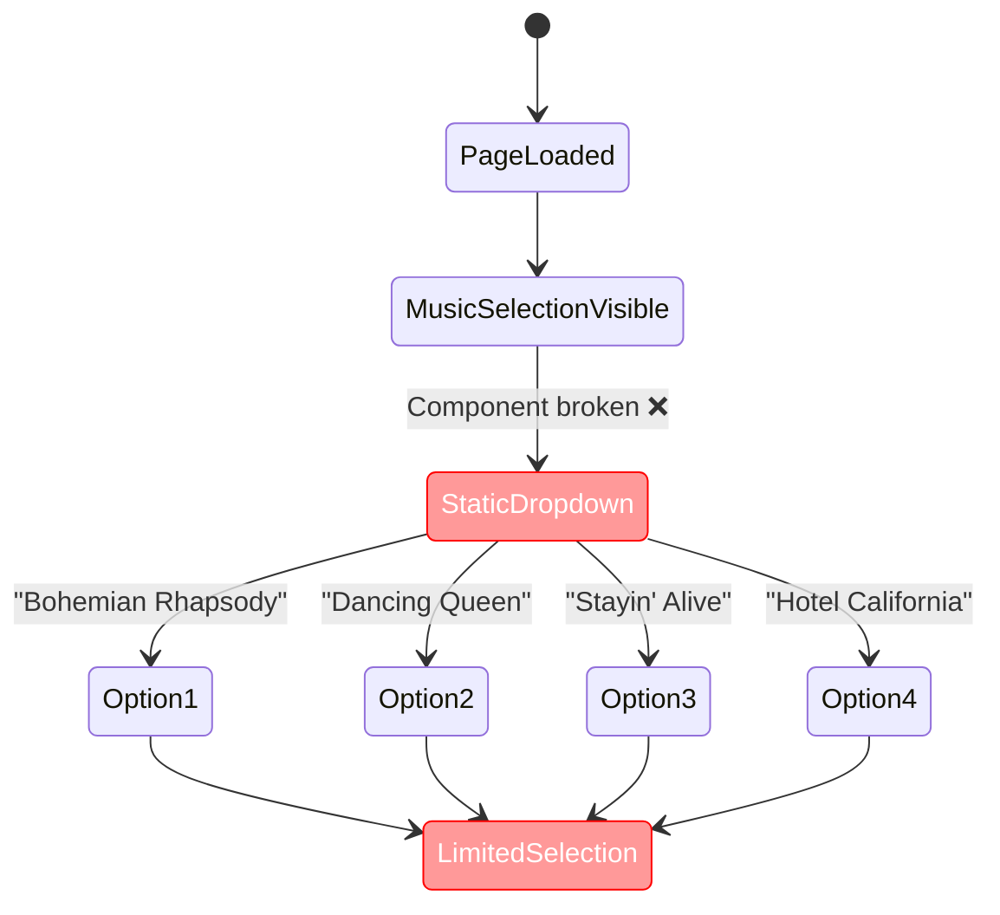
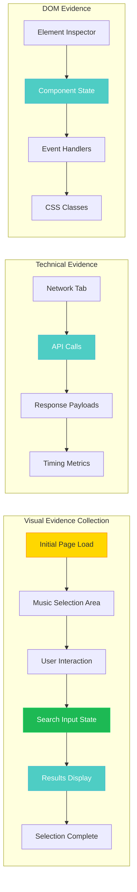
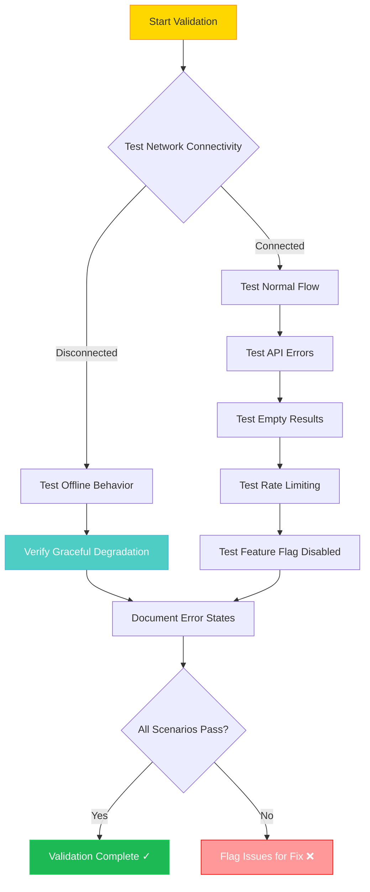
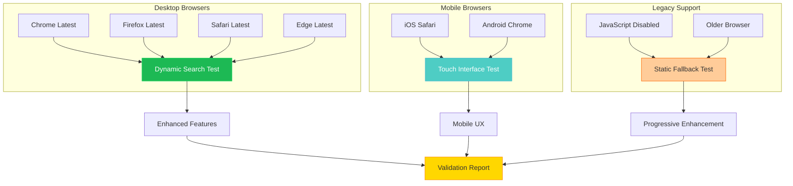

# Production UI Validation - Process Diagrams

## Validation Flow Overview

### Current Incomplete Validation vs Target Complete Validation

```mermaid
flowchart TD
    subgraph "Previous Incomplete Validation"
        A1[Deploy to Production] --> B1[Test API Endpoint Only]
        B1 --> C1[curl /api/music-search]
        C1 --> D1[JSON Response OK]
        D1 --> E1[Declare Success ❌]
    end
    
    subgraph "Complete Validation Required"
        A2[Deploy to Production] --> B2[Test API Endpoint]
        B2 --> C2[Test UI Behavior]
        C2 --> D2[Test User Experience]
        D2 --> E2[Document Evidence]
        E2 --> F2[Declare Success ✓]
    end
    
    style A1 fill:#ff9999,stroke:#ff0000,color:#fff
    style E1 fill:#ff9999,stroke:#ff0000,color:#fff
    style A2 fill:#1DB954,stroke:#1ed760,color:#fff
    style F2 fill:#1DB954,stroke:#1ed760,color:#fff
    style C2 fill:#4ecdc4,stroke:#45b7d1,color:#fff
```

### Complete Production Validation Process

## UI Behavior States

### Expected Dynamic Search Flow

### Failure State - Static Dropdown

## Validation Evidence Collection

### Screenshot Capture Strategy

## Performance Validation Matrix

### Response Time Measurement

```mermaid
gantt
    title Production Performance Validation
    dateFormat X
    axisFormat %L ms
    
    section Search Input
    User types query         :0, 50
    Debounce delay          :50, 350
    
    section API Request
    Network request         :350, 450
    Spotify API processing  :450, 650
    Response processing     :650, 750
    
    section UI Update
    DOM manipulation        :750, 800
    Album art loading       :800, 1000
    Results rendered        :1000, 1050
    
    section Target Metrics
    Total user wait         :crit, 50, 750
    Target threshold        :milestone, 550
```

## Error Scenario Testing

### Comprehensive Error Handling Validation

## Browser Compatibility Validation

### Cross-Platform Testing Matrix

The diagrams illustrate the complete validation process needed to verify that the dynamic music search UI integration is working correctly in production, with comprehensive error handling and evidence collection.