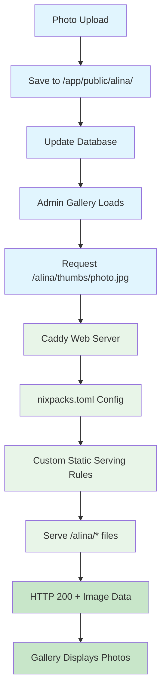

# Railway Static Assets Architecture Diagram

## Current Problem Flow

```mermaid
flowchart TD
    A[Photo Upload] --> B[Save to /app/public/alina/]
    B --> C[Update Database]
    C --> D[Admin Gallery Loads]
    D --> E[Request /alina/thumbs/photo.jpg]
    E --> F{Railway Static Serving}
    F -->|404 Error| G[Empty Gallery Display]
    F -->|Basic files work| H[/favicon.svg - HTTP 200]
    
    style A fill:#e1f5fe
    style B fill:#e1f5fe
    style C fill:#e1f5fe
    style D fill:#fff3e0
    style E fill:#fff3e0
    style F fill:#ffebee
    style G fill:#ffcdd2
    style H fill:#c8e6c9
```

## Solution Architecture



## Configuration Components

```mermaid
graph LR
    A[nixpacks.toml] --> B[Build Configuration]
    A --> C[Provider Setup]
    A --> D[Start Command]
    
    E[Caddyfile] --> F[Static Route Rules]
    E --> G[/alina/* Serving]
    E --> H[Fallback Handling]
    
    B --> I[Railway Deployment]
    F --> I
    I --> J[Production Static Serving]
    
    style A fill:#bbdefb
    style E fill:#c8e6c9
    style I fill:#fff3e0
    style J fill:#e8f5e8
```