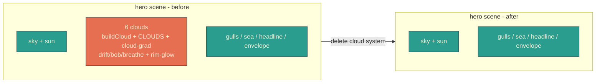
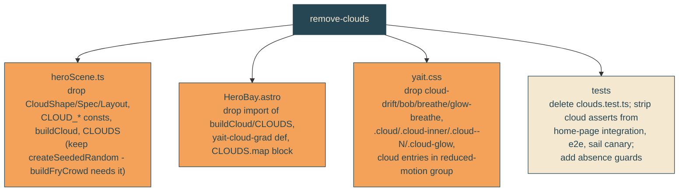

# remove-clouds

## Verbatim request (2026-06-14)

> hmm, can we delete the existing clouds entirely?
> [chosen: Yes, remove all clouds]

## Confirmed understanding

Remove the entire sunset-cloud system from the yait hero scene. The sky band
becomes clear: the sun discs, sea, gulls, headline, and envelope all stay. This
deletes the cloud geometry generator, the cloud layout data, the cloud markup,
the cloud gradient that nothing else uses, the cloud CSS (drift / bob / breathe /
rim-glow pulse and their reduced-motion entries), and every cloud test.

## Scope boundary

The `index.astro` corner clouds (`.cloud-bubble` / `#clouds-container`) belong to
the separate live birthday RSVP page (guarded by the `favoriteSong` regression
test). They are NOT part of the yait hero scene and are out of scope - untouched.

## Mechanism

## Validation

To validate remove-clouds I can screenshot the sky band and confirm there are no
cloud silhouettes (clear gradient sky with the sun, gulls, sea, headline, and
envelope intact), CURL the served `/home` and grep that there is no `class="cloud`,
no `cloud-glow`, and no `yait-cloud-grad`, and confirm the birthday `/` page still
serves its RSVP form (corner clouds untouched). The test suite asserts the cloud
markup and keyframes are gone while the sun, headline, and envelope remain.

## Out of scope

The sun, sea, gulls, headline reveal, envelope, whip clip, and the separate
`index.astro` corner clouds. Only the hero-scene cloud system is removed.
