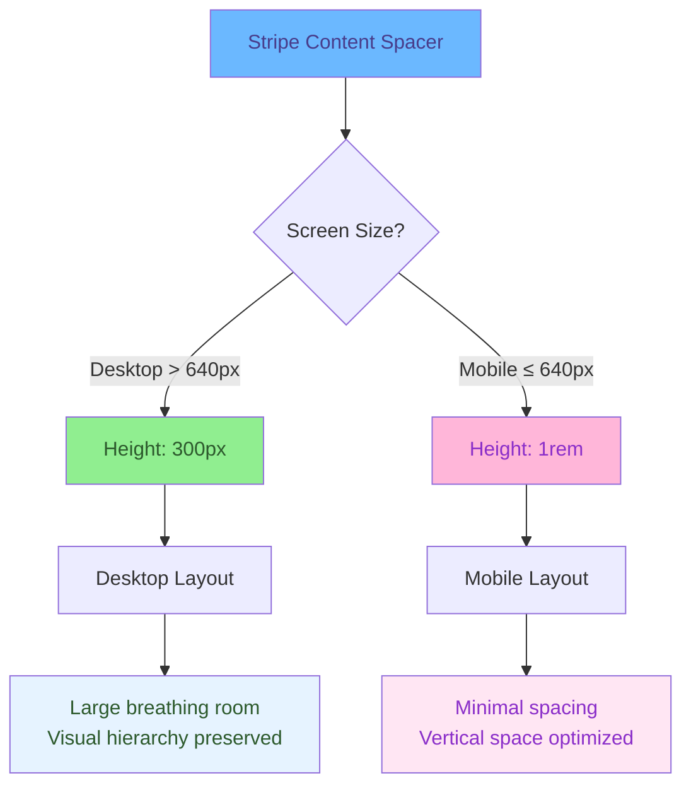
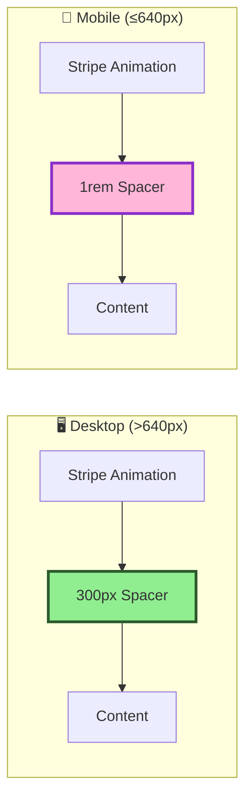

# Responsive Spacing Diagram

```mermaid
graph TD
    A[Stripe Content Spacer] --> B{Screen Size?}
    
    B -->|Desktop > 640px| C[Height: 300px]
    B -->|Mobile ≤ 640px| D[Height: 1rem]
    
    C --> E[Desktop Layout]
    D --> F[Mobile Layout]
    
    E --> G[Large breathing room<br/>Visual hierarchy preserved]
    F --> H[Minimal spacing<br/>Vertical space optimized]
    
    style A fill:#6BB8FF,color:#483D8B
    style C fill:#90EE90,color:#2D5A2D
    style D fill:#FFB6D9,color:#8B2FC9
    style G fill:#E6F3FF,color:#2D5A2D
    style H fill:#FFE6F3,color:#8B2FC9
```

## Visual Comparison

```mermaid
flowchart LR
    subgraph Desktop["🖥️ Desktop (>640px)"]
        D1[Stripe Animation] --> D2[300px Spacer] --> D3[Content]
    end
    
    subgraph Mobile["📱 Mobile (≤640px)"]
        M1[Stripe Animation] --> M2[1rem Spacer] --> M3[Content]
    end
    
    style D2 fill:#90EE90,stroke:#2D5A2D,stroke-width:3px
    style M2 fill:#FFB6D9,stroke:#8B2FC9,stroke-width:3px
```