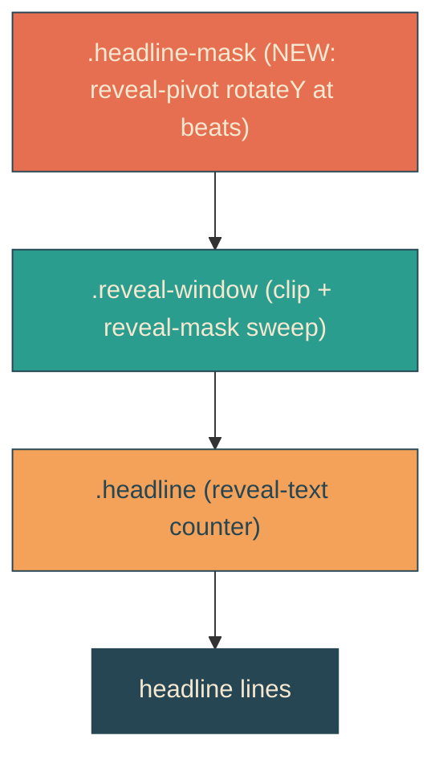
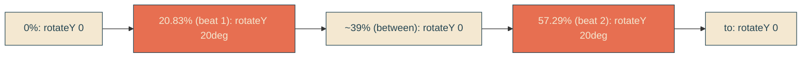

# reveal-beat-pivot

## Verbatim request (2026-06-13)

> can we actually do the same rotational effect on the reveal line as it goes?

(Following [[envelope-beat-pivot]], which swivels the envelope toward the screen at
the two inner beats.)

## Confirmed understanding

Apply the same rotateY beat-swivel to the headline reveal: the revealed text and its
wavy edge swivel toward the viewer (~20 degrees, with perspective) at the two inner
beats and return flat, in unison with the envelope's pivot. The headline is much
wider than the envelope, so the perspective is larger to keep it a tasteful swivel
rather than a violent foreshorten.

## Mechanism

The pivot goes on `.headline-mask`, the outer headline container, which currently
carries no transform - so a rotateY animation lives there with no conflict (the sweep
`reveal-mask` is on the inner `.reveal-window`, and the counter `reveal-text` on
`.headline`). Rotating `.headline-mask` tilts the whole revealed headline - clip edge
and text together - so "the reveal line" itself swivels.

The `reveal-pivot` keyframes run over the reveal duration (5.333s) with peaks at the
reveal's two inner beats (20.83% and 57.29%) - the same real-time moments (~1.1s and
~3.05s) as the envelope's pivot - so the headline and envelope swivel together.

## Validation

To validate reveal-beat-pivot I can pin the reveal clock at a beat (1111ms) and
confirm `.headline-mask` carries a non-identity 3D transform (matrix3d) that returns
toward identity between beats; and review a capture to confirm the headline swivels
tastefully (not distorted) in unison with the envelope.

## Out of scope

Sail/reveal timing, beats, the whip, the existing envelope pivot. The reveal pivot is
additive on `.headline-mask`; no markup change.
