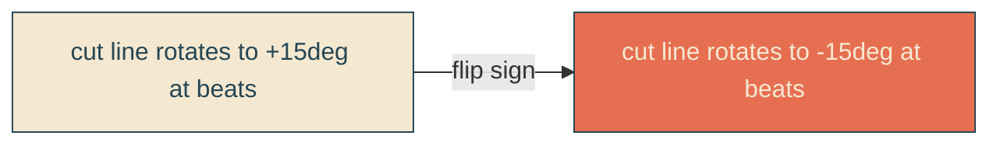

# reverse-cut-spin

## Verbatim request (2026-06-13)

> can we reverse the direction of the spin on the reveal line for the letters?

## Confirmed understanding

Flip the direction of the [[cut-edge-pivot]] clip rotation. The wavy reveal cut line
currently swivels to +15 degrees at the two inner beats; reverse it to -15 degrees so
it tilts the opposite way. The letters still do not move (only the clip boundary
rotates).

## Mechanism

One value change in the clip's `<animateTransform type="rotate">`: the peak rotation
`15` -> `-15` (center and timing unchanged).

## Validation

To validate reverse-cut-spin I can read the clip path's animated rotate at a beat and
confirm it is -15 degrees (was +15), and that a revealed glyph stays byte-stable.

## Out of scope

The whip morph, reveal/sail timing, clouds, envelope - all unchanged. Letters do not
move.
