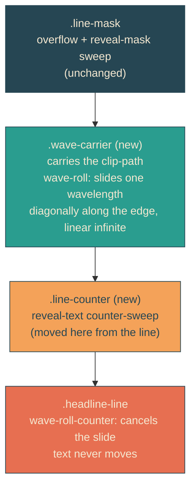

# rolling-waves

## Verbatim request (2026-06-12)

> can we make those slanted wave lines that reveal the text be animated slowly? so
> they look to be like ocean waves?

## Confirmed understanding

The wave crests roll slowly and continuously along both reveal edges like ocean
swell — toward the dock, about 4 seconds per wavelength, looping seamlessly —
independent of the reveal sweep, which is untouched. Static under reduced motion.

## How: a diagonal clip-slide, still transform-only

Because the wave pattern is periodic along the edge, sliding the clip exactly one
wavelength parallel to the edge (slantPx/periods horizontally, maskH/periods
vertically) and snapping back is invisible — a seamless rolling loop. All four
layers animate transform only, so the compositor guarantee genuinely holds even
with the edge in perpetual motion. The clip path gains margins (one extra
wavelength of wave at each end, half a box of enclosure) so the slide never
uncovers a corner.

## Plan

1. `heroScene.ts`: `buildWaveEdgePath` extends its wave by one period beyond each
   end and its enclosing region by half a box; `WAVE_ROLL` derivation exports
   `{ xPercent, yPercent, durationMs }` — one wavelength as carrier-box
   percentages (2.89063 and 20 at reference) at 4000ms.
2. Unit tests (failure-first): extended anchors land on zero-phase wave points at
   exactly minus-one and plus-one period; region opens at -0.5 -0.5; all central
   invariants (45 degrees, amplitude, extrema counts, C1 joints, apex centering)
   re-asserted on anchors filtered to the visible box; WAVE_ROLL derivation exact.
3. Markup/CSS: per-line nesting becomes mask, wave-carrier (clip + wave-roll),
   line-counter (reveal-text, taking the mobile name swap and top-line delay),
   headline-line (wave-roll-counter); reduced-motion list covers the new layers.
4. E2E: slant and amplitude probes filter to central anchors; a new rolling test
   pins two clocks 2 seconds apart and asserts the carrier transform changed while
   a word's bounding rect stayed identical (waves move, text does not); the
   compositor guard remains and now genuinely covers the rolling edge.
5. Validate locally (suites, frames), deploy with sentinel = compiled stylesheet
   containing "wave-roll", forensics pre/post.

### PR checklist pass

Derivations beside their data; one purpose per layer and per function; keyframe
values generated from the same geometry the clip uses (no hand-forked numbers); no
comments; unit + canary + integration + e2e cover the motion and the no-net-drift
property.
