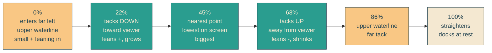

# s-curve-sail-in

## Verbatim request (2026-06-11)

> that is an incredible first pass. can we have the envelope boat sailing in from the
> left side of the water and making an S shape if you were to see it from above but
> from our view a bit of a gentle zig zag as it comes in to the dock?

## Confirmed understanding

The envelope still enters from the left over the water on the same 5-second schedule
with unchanged word-reveal timing, but its course is now an S shape as seen from
above. From our side-on view that reads as a gentle zig-zag: the boat drifts down
the waterline (toward the viewer), then back up (away), straightening as it reaches
the dock. Heading leans match each tack, and a subtle scale change (about 4 percent)
sells near/far depth. Transform-only, reduced-motion fallback unchanged.

## The course at a glance

## Implementation plan

1. **Path as data:** `SAIL_PATH: SailWaypoint[]` exported from `lib/yait/heroScene.ts`
   (offset, xVw, yPx, rotateDeg, scale per waypoint). The stylesheet's `@keyframes
   sail` is hand-authored from these numbers.
2. **Unit tests (failure-first):** path starts offscreen left and ends at rest
   (all-zero, scale 1); offsets strictly increase 0 to 1; x strictly increases
   (always approaching); y changes direction at least twice (the S); bounded
   amplitudes (|y| <= 24px, |rotate| <= 4deg, scale within 0.95-1.05); lean sign
   matches tack direction per segment.
3. **CSS canary:** a test parses `@keyframes sail` out of yait.css and asserts every
   SAIL_PATH waypoint appears with matching percentage and transform values — the
   stylesheet cannot drift from the spec silently.
4. **E2E addition:** assert the envelope's sail animation keyframes (via
   `getAnimations`) include nonzero translateY — the zig-zag exists in the live
   page, deterministically (no mid-animation timing sampling). Existing compositor
   guard already proves transform-only.
5. **Validation and deploy:** local rebuild, curl content suite unchanged, mid-sail
   screenshot showing the down-tack, deploy with sentinel = prod /home stylesheet
   containing a distinctive new waypoint value.

### PR checklist pass

- Path data lives beside the other scene config in `heroScene.ts` (right home, no
  misplaced utility); no inline styles (keyframes stay in yait.css); nothing
  duplicated (sail keyframes are modified in place); waypoints are typed exported
  data, testable without a browser; no comments; unit + canary + e2e cover it.
