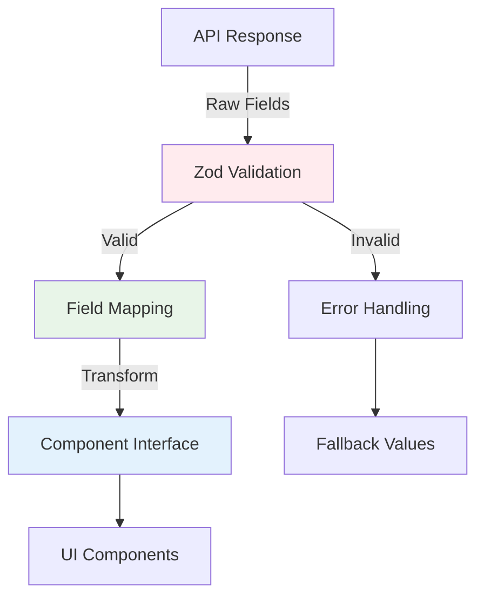

# Schema Validation Fix

## Problem Statement

Zod validation errors appearing in console because API response schemas expect different field names than what the APIs actually return:

- **Expected**: `name`, `path` fields on photo objects
- **Actual**: `original_filename`, `upload_date`, `id` etc. fields in API responses
- **Result**: Validation failures causing console errors and empty arrays returned

## Root Cause

The Zod schemas were created based on assumed TypeScript interface structure rather than the actual API response format. The real photo API returns database fields directly, not the transformed `PhotoAsset` interface expected by components.

## Current Error Pattern

```javascript
API response validation failed: ZodError: [
  {
    "expected": "string",
    "code": "invalid_type", 
    "path": ["photos", 0, "name"],
    "message": "Invalid input: expected string, received undefined"
  },
  {
    "expected": "string",
    "code": "invalid_type",
    "path": ["photos", 0, "path"], 
    "message": "Invalid input: expected string, received undefined"
  }
]
```

## Solution Approach

1. **Update Zod schemas** to match actual API response field names
2. **Add field mapping** to transform API responses into expected component format
3. **Maintain backward compatibility** with existing component interfaces
4. **Add comprehensive validation** for all actual API fields

## API Response Analysis

**Photos API** actual structure:
```json
{
  "success": true,
  "photos": [
    {
      "id": "b51d1a6da52d9426d32934683849f612",
      "upload_date": "2026-05-30T06:47:26.935Z", 
      "is_approved": false,
      "original_filename": "test-photo.jpeg",
      "file_size": 1328537,
      "upload_ip": "127.0.0.1",
      "is_hidden": false,
      "moderation_notes": null
    }
  ],
  "count": 27
}
```

**Component Interface** expected structure:
```typescript
interface PhotoAsset {
  id: string;
  name: string;
  path: string;
}
```

## Success Criteria

- [ ] No Zod validation errors in console
- [ ] Photos and overlays load correctly in admin interface  
- [ ] Dashboard stats calculate properly
- [ ] Component interfaces remain unchanged
- [ ] Comprehensive field mapping between API and component formats

## Architecture Impact

**Low risk** - Changes isolated to response validation layer, no component interface changes needed.

