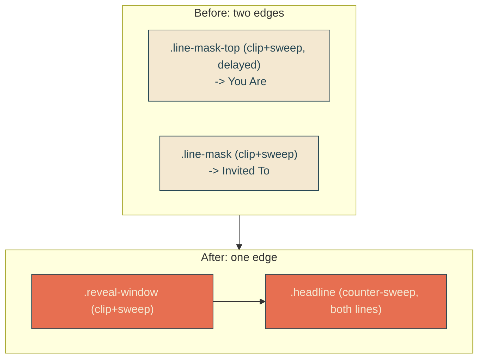

# single-reveal-edge

## Verbatim request (2026-06-13)

> we're getting there! let's make it just 1 reveal line for both lines of text

## Confirmed understanding

Reveal the whole two-line headline with ONE continuous diagonal whip edge instead of
the two separate per-line edges. One masked window wraps both lines, one sweep, one
whip clip with one travelling bump spanning the full headline height. The per-line
stagger (the top-line delay) is removed.

## Structure change

Before: each line is its own `.line-mask` (clip + sweep) with an inner
`.headline-line` counter-sweep, and `.line-mask-top` trails by a delay.

After: one `.reveal-window` (clip + sweep) wraps the whole `.headline`, which
counter-sweeps as a single block; the lines are plain blocks.

## Geometry

The clip now maps to the two-line block box (full width x ~370px, two 185px lines).
To keep the 45-degree slant the whip geometry scales to the block:
`WHIP_GEOMETRY.maskH` and `slantPx` 185 -> 370 (still `slantPx === maskH`, so 45
degrees). `viewportW` (1280), `amplitudePx` (34), `widthFrac`, `samples` unchanged.
One bump travels the full diagonal across both lines.

## Removed as dead

The staggered-reveal machinery is gone: `REVEAL_STAGGER_PX`, `REVEAL_TOP_DELAY_MS`,
the `revealDelayMs` helper, the `.line-mask-top` delay rules, and the
"independent lines" / top-delay tests. The reveal sweep keyframes (`reveal-mask` /
`reveal-text` and their mobile variants) and `REVEAL_EDGE` are unchanged - they drive
the single sweep now.

## Accessibility

Reduced motion disables `.reveal-window` and `.headline` animations, so the headline
rests fully revealed (window at translateX 0 parks the slant off the text) with no
sweep; the morph node is still stripped by the inline script.

## Validation

To validate single-reveal-edge I can load /home and confirm one continuous diagonal
edge wipes the entire headline as a unit (no line trailing the other), the rendered
slant is ~45 degrees across the block, and one bump travels the full edge.

## Out of scope

- Whip shape/cadence (matched to gallery #7), entrance timing, amplitude, docked
  rest position.
