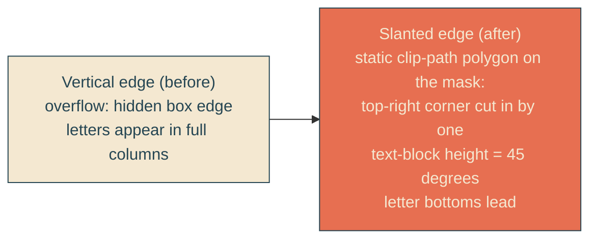

# slanted-reveal-edge

## Verbatim request (2026-06-12)

> awesome. Can we make the line that reveals the text be at an angle? perhaps 45
> degree angle slanting where the top points to the left of the page and the bottom
> to the right

## Confirmed understanding

The reveal boundary tilts to about 45 degrees: the top of the edge leans left, the
bottom leans right, so each letter's bottom emerges slightly before its top as the
stern-locked wipe sweeps by. Same timing, same stern lock, transform-only animation.

## How: a static slanted clip on the moving mask

The clip shape never animates — only the mask's translateX does, carrying its
slanted boundary with it — so the compositor-only guarantee is untouched. The cut
corner lives in the viewport's right edge at rest, far from the left-aligned
lockup, so the settled headline is fully visible. The shared font-size moves into a
custom property (`--headline-fs`) consumed by both the font-size rule and the slant
calc, so the 45-degree relationship tracks the type size at every viewport with no
duplicated values.

## Plan

1. CSS only: `--headline-fs: clamp(2.6rem, 8.5vw, 6.6rem)` on `.headline-mask`;
   `.headline` consumes it for font-size; the mask gains
   `clip-path: polygon(0 0, calc(100% - var(--headline-slant)) 0, 100% 100%, 0 100%)`
   with `--headline-slant: calc(var(--headline-fs) * 2.7)` (2.7 text-block heights
   approximated from two 1.1-line-height lines plus word padding).
2. Canary (failure-first): the stylesheet contains the polygon rule and the slant
   custom property derived from `--headline-fs`; font-size rule consumes the same
   property (no duplicated clamp).
3. E2E (failure-first): the mask's computed clip-path is a polygon; the resolved
   slant offset (parsed from the computed polygon) is within 25 percent of the
   mask's rendered height — the edge angle stays in the 39-52 degree band around
   45; the animated keyframe properties remain transform/opacity only (existing
   compositor guard re-asserts this).
4. Validate locally (suites, mid-reveal frames showing the slanted boundary
   slicing letters bottom-first, both viewports), deploy with sentinel = compiled
   stylesheet containing "clip-path:polygon", forensics pre/post.

### PR checklist pass

Pure CSS feature in yait.css (no misplaced utilities, no inline styles); the
font-size clamp is consolidated into one custom property rather than duplicated;
no comments; canary plus geometric e2e cover it; heroScene data untouched.
