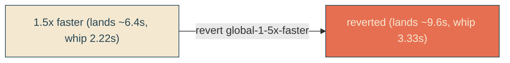

# slow-back-down

## Verbatim request (2026-06-13)

> let's actually slow it back down

## Confirmed understanding

Undo the [[global-1-5x-faster]] speedup exactly, restoring the timings from just
before it. Everything else stays: the whip shape (matched to gallery #7), the single
reveal edge, and the fast first leg are unchanged - only the 1.5x duration scaling is
reverted.

Restored durations (x1.5 back up = the pre-speedup values):

| thing                  | sped-up | restored |
|------------------------|---------|----------|
| sail (`SAIL_MS`)       | 5333    | 8000     |
| dock settle (`SETTLE_MS`) | 1067 | 1600     |
| reveal (`REVEAL_DURATION_MS`) | 6400 | 9600 |
| whip cadence (`WHIP_DURATION_MS`) | 2222 | 3333 |
| fry bounce stagger (`BOUNCE_STEP_MS`) | 60 | 90 |
| lean cycle (`LEAN_CYCLE_MS`) | 2667 | 4000 |
| CSS bob / lean / fry-bounce / cta-rise | 2.267 / 2.667 / 0.733 / 0.6s | 3.4 / 4 / 1.1 / 0.9s |

Entrance lands at ~9.6s again; whip cracks at 3.33s/cycle. Alignment holds
(`SAIL_MS + SETTLE_MS = 9600 = REVEAL_DURATION_MS`).

## Mechanism

The 1.5x change was a single self-contained commit (`global-1-5x-faster
implementation`). Reverting that commit restores the exact prior source, CSS, and
test values with no rounding drift. The feature docs for global-1-5x-faster remain in
history as a record; this folder records the deliberate slow-back-down.

## Validation

To validate slow-back-down I can confirm the served CSS carries `sail-x 8s`,
`reveal-mask 9.6s`, the whip `dur="3.333s"`, and that the entrance lands at ~9.6s
again; unit/canary/e2e assert the restored timings.

## Out of scope

Whip shape, single-edge structure, fast first leg, geometry - all unchanged.
