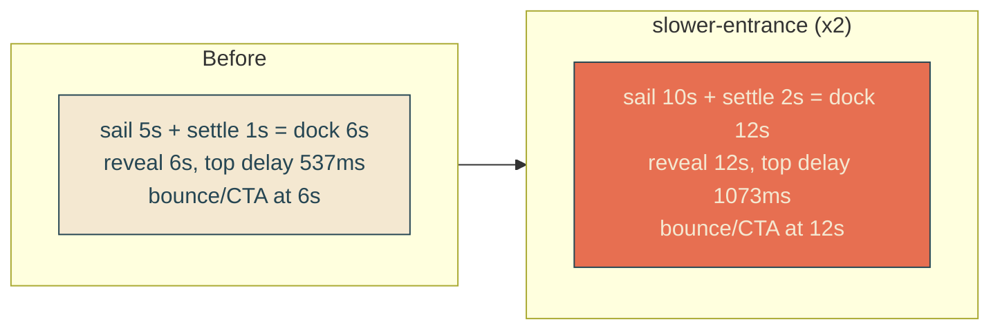

# slower-entrance

## Verbatim request (2026-06-13)

> can we slow down the boat speed and reveal speed by making it 2x as long?

## Confirmed understanding

Play the one-time intro at half speed by doubling its durations. Keyframe positions
are unchanged (same path, same end state); only the time taken doubles. The looping
idle motions (the docked envelope bob, the fry bounce/lean, the whip-crack cadence)
keep their current rhythm - only the entrance slows.

Scaled (x2):

- Sail travel: 5s -> 10s (`SAIL_MS`).
- Dock settle: 1s -> 2s (`SETTLE_MS`).
- Headline reveal: 6s -> 12s (`REVEAL_DURATION_MS`).

Everything keyed off those follows automatically because it is derived:

- `REVEAL_TOP_DELAY_MS` recomputes from the reveal duration: 537ms -> 1073ms.
- `SCENE_TIMELINE.bounceStartMs` / `ctaRiseStartMs` = `SAIL_MS + SETTLE_MS`:
  6000 -> 12000, so the fry bounce and the CTA rise still begin exactly when the boat
  docks and the reveal finishes (all aligned at 12s, as they were aligned at 6s).

The CSS animation durations and the top-line `animation-delay` are literal strings,
so they are updated to match and the keyframe canary re-verifies consistency.

## What stays the same

- Keyframe values (sail track, weave, reveal edge percentages, whip frames).
- Loop cadences: `bob 3.4s`, fry `lean 4s` / `fry-bounce 1.1s`, whip `dur 1.4s`,
  `cta-rise 0.9s` rise motion (only its start delay shifts).

## Validation

To validate slower-entrance I can load /home and confirm the boat takes ~10s to
reach the dock and the headline finishes revealing at ~12s, with the bounce/CTA
firing as it lands, and the idle bob and whip still at their old speed. Unit/canary
assert the doubled constants and that the CSS durations match; e2e time-pins are
rescaled to the new timeline.

## Out of scope

- Loop cadences, keyframe shapes, the whip geometry, the docked rest position.
