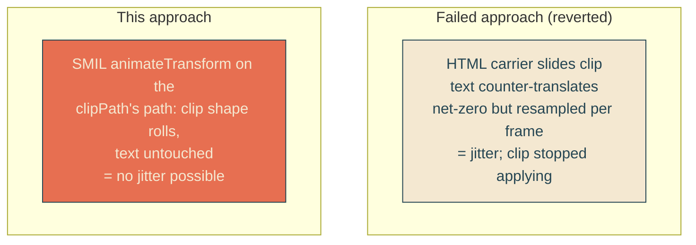

# smil-rolling-waves

## Verbatim request (2026-06-12)

> okay it's reverted! can we make the sine waves be animated? let's take a
> different approach from last time

## Confirmed understanding

The wave crests roll slowly along both reveal edges (one wavelength per 4s,
toward the dock, seamless loop) — but the mechanism is the opposite of the failed
attempt: instead of sliding an HTML carrier and counter-translating the text, a
SMIL animateTransform inside the shared SVG clipPath translates the clip shape
itself. No carrier, no counter layer: the text elements are never transformed, so
the jitter that sank the last attempt is physically impossible rather than
cancelled out. Accepted trades, confirmed: a bounded per-frame repaint of the two
clipped line layers, and the page's first runtime JavaScript — a one-line inline
script removing the animation node under prefers-reduced-motion (SMIL ignores the
media query).

## Old versus new at a glance

The path regains its sliding margins (one zero-phase wavelength beyond each slant
end, half-box enclosure) so the translation never uncovers a corner. The roll
vector is one wavelength in objectBoundingBox units: (slantFrac/periods,
1/periods) = (0.02891, 0.2).

## Plan

1. `heroScene.ts`: restore the extended-margin generator (margins re-enter with
   their unit tests) and export `WAVE_ROLL = { xBox, yBox, durationMs: 4000 }` in
   box units.
2. `HeroBay.astro`: `<animateTransform attributeName="transform" type="translate"
   from="0 0" to="0.02891 0.2" dur="4s" repeatCount="indefinite">` inside the
   clipPath path; `home.astro` head gains the one-line reduced-motion script.
3. CSS: untouched — the clip stays on `.line-mask` exactly as the reverted state.
4. Tests (failure-first): margin generator invariants (zero-phase extended
   anchors, region corners, central invariants preserved); WAVE_ROLL derivation;
   integration asserts the animateTransform with the exact to/dur and the
   reduced-motion script ship in the HTML.
5. E2E live-pixel validation (the lesson from the regression): pin the CSS
   animations at 3.0s and let SMIL run free in real time — two screenshots of the
   edge region 1s apart must differ (the wave genuinely rolls in rendered pixels)
   while a fully-revealed word region is byte-identical (no jitter); plus a
   reduced-motion run asserting the animation node is removed.
6. Validate locally including live capture at both viewports, deploy with sentinel
   = prod /home HTML containing "animateTransform", forensics pre/post, and a
   live-pixel prod probe before declaring success.

### PR checklist pass

Generator margins return to the single generator function (no fork); the roll
constants derive from WAVE_GEOMETRY (no hand numbers); the inline script is one
statement with one purpose; no comments; unit + integration + live-pixel e2e
cover exactly the two failure modes that occurred last time.
