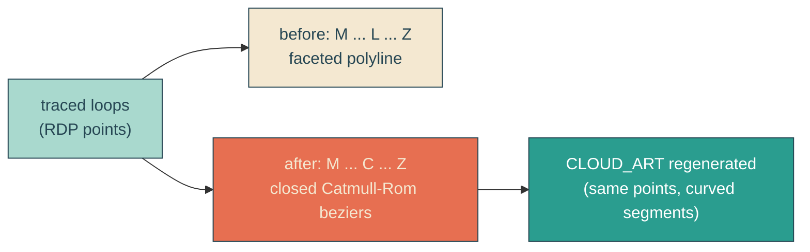

# smooth-cloud-curves

## Verbatim request (2026-06-14)

> can we look at making the clouds smoother in their curves?

## Confirmed decisions

- **Method: curve-fit the outlines.** Convert the traced straight-segment (`L`)
  outlines into smooth cubic beziers (`C`) via Catmull-Rom through the existing
  points. No re-tracing, no extra point dropping.
- **Roundness: faithful + smooth.** Round off the facets but keep the cloud shapes
  essentially as traced (same vertices, same RDP tolerance).

## Mechanism

The tracer already produces closed loops of points (RDP-simplified). Today it emits
them as polylines (`M p0 L p1 L p2 ... Z`), so the silhouette is faceted. Switch the
emitter to a closed uniform Catmull-Rom, turning each pair of points into a cubic
bezier whose control points use the neighbouring vertices as tangents:

```
c1 = p[i]   + (p[i+1] - p[i-1]) / 6
c2 = p[i+1] - (p[i+2] - p[i]) / 6
d  = "M p0 C c1 c2 p1  C ... C ... p0 Z"   (indices wrap; loop is cyclic)
```

Because the curve interpolates the original points, the shape stays faithful; only the
segments between points become smooth instead of straight.



## Out of scope

The warp filter, breathing, placement, sky, and palette all stay. Only the path
command data in `CLOUD_ART` changes (straight segments -> bezier curves). The
`HeroBay.astro` markup and `yait.css` are untouched.

## Validation

To validate smooth-cloud-curves I can regenerate `cloudArt.ts`, confirm each layer
path now uses `C` bezier segments (and still opens with `M` / closes with `Z`),
rebuild and redeploy locally, then screenshot the hero and compare the lobe edges
against the prior faceted capture to confirm the curves read smoother while the cloud
shapes and arrangement are unchanged. The unit test pins the bezier contract; the
integration / canary / e2e are unaffected (they do not inspect path commands) and are
re-run to confirm no regression.
