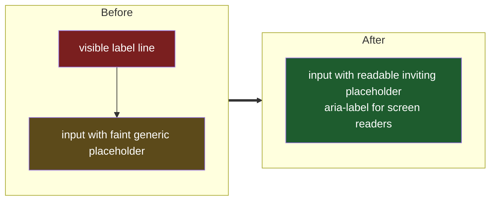

# Song Input Placeholder

## Understanding

Three changes to the song field in the RSVP modal:

1. Placeholder text becomes "Search Spotify for a fun song for the party playlist".
2. The placeholder gets readable contrast — today it renders at 50% opacity silver on the
   dark input, which is hard to read.
3. The visible label above the input ("Disco song for the party playlist (optional)") is
   removed; the input gains an `aria-label` with the same wording so screen readers keep an
   accessible name. The flag-disabled fallback select keeps its label (a select has no
   placeholder to carry the meaning).

## Outcome

- The modal song field is one visual line: a clearly readable invitation to search.
- Placeholder color moves from a half-opacity utility class to a dedicated style rule on
  the search input at warm-cream with comfortable contrast.
- Accessibility preserved via `aria-label`; the accessibility suite's label-association
  test is updated to assert the aria-label accessible name.
- Deployed to production once verified locally.
