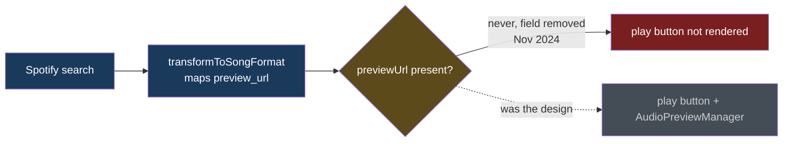
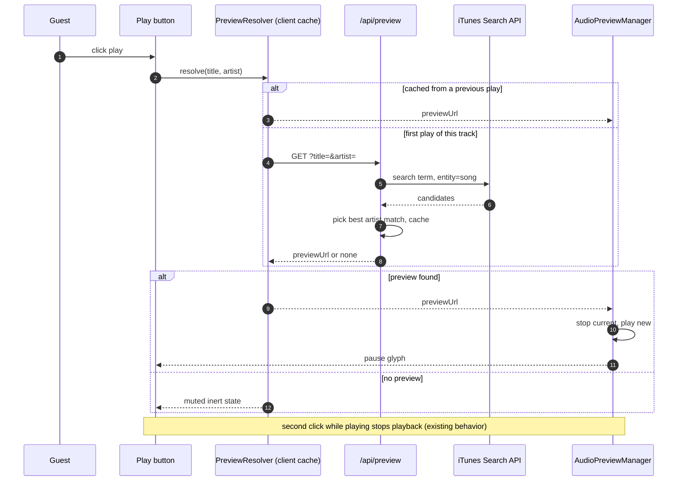
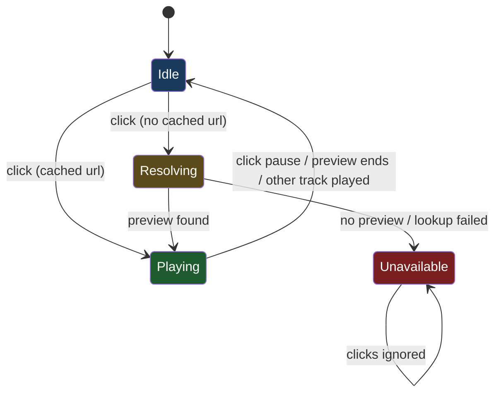

# Song Preview Playback — Diagrams

## Why the existing play button never appears

```mermaid
flowchart LR
    A[Spotify search] --> B[transformToSongFormat<br/>maps preview_url]
    B --> C{previewUrl present?}
    C -->|never, field removed<br/>Nov 2024| D[play button not rendered]
    C -.->|was the design| E[play button + AudioPreviewManager]

    style A fill:#1a3a5c,color:#fff
    style B fill:#1a3a5c,color:#fff
    style C fill:#5c4a1a,color:#fff
    style D fill:#7a1f1f,color:#fff
    style E fill:#444c56,color:#ccc
```

## Target: lazy preview resolution per play click

```mermaid
sequenceDiagram
    autonumber
    participant U as Guest
    participant BTN as Play button
    participant PR as PreviewResolver (client cache)
    participant API as /api/preview
    participant IT as iTunes Search API
    participant AM as AudioPreviewManager

    U->>BTN: click play
    BTN->>PR: resolve(title, artist)
    alt cached from a previous play
        PR-->>AM: previewUrl
    else first play of this track
        PR->>API: GET ?title=&artist=
        API->>IT: search term, entity=song
        IT-->>API: candidates
        API->>API: pick best artist match, cache
        API-->>PR: previewUrl or none
    end
    alt preview found
        PR-->>AM: previewUrl
        AM->>AM: stop current, play new
        AM-->>BTN: pause glyph
    else no preview
        PR-->>BTN: muted inert state
    end

    Note over BTN,AM: second click while playing stops playback (existing behavior)
```

## States of one play button

```mermaid
stateDiagram-v2
    classDef idle fill:#1a3a5c,color:#fff
    classDef busy fill:#5c4a1a,color:#fff
    classDef playing fill:#1e5c2e,color:#fff
    classDef dead fill:#7a1f1f,color:#fff

    [*] --> Idle
    Idle --> Resolving: click (no cached url)
    Idle --> Playing: click (cached url)
    Resolving --> Playing: preview found
    Resolving --> Unavailable: no preview / lookup failed
    Playing --> Idle: click pause / preview ends / other track played
    Unavailable --> Unavailable: clicks ignored

    class Idle idle
    class Resolving busy
    class Playing playing
    class Unavailable dead
```
