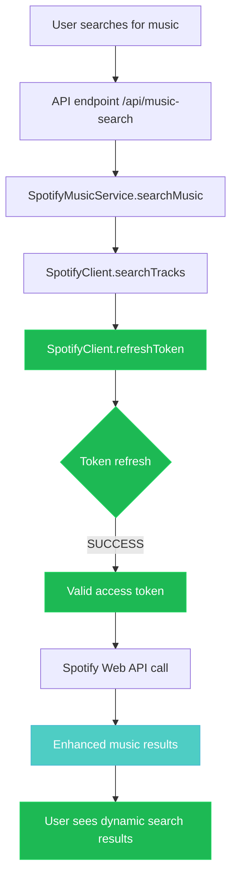
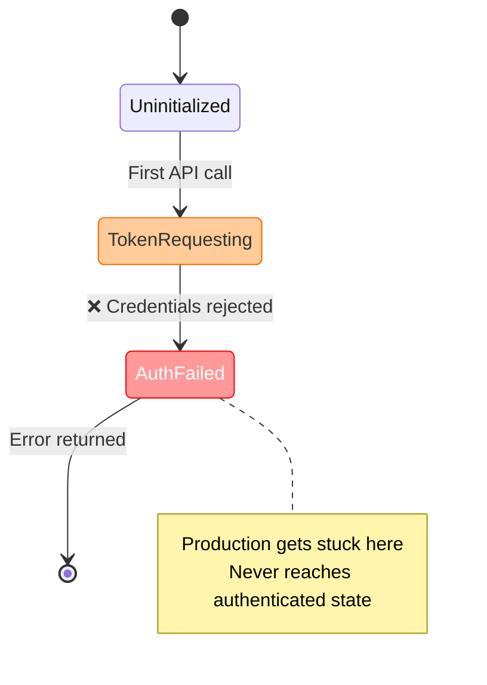
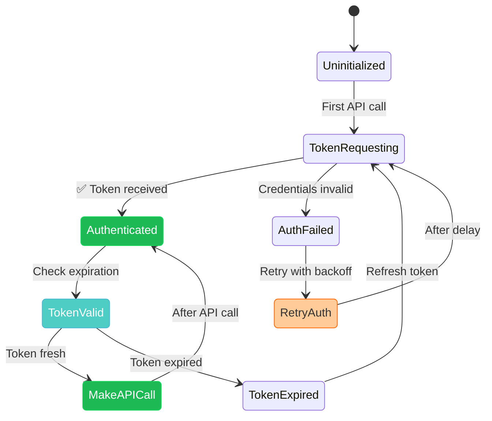
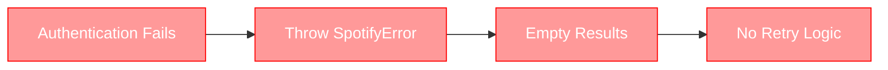
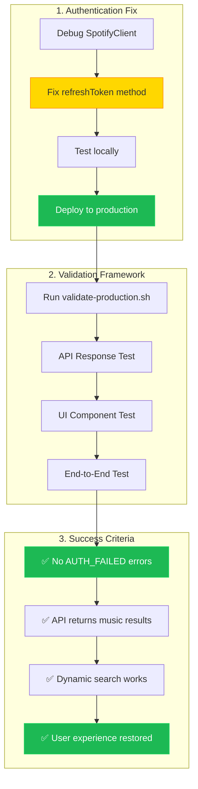
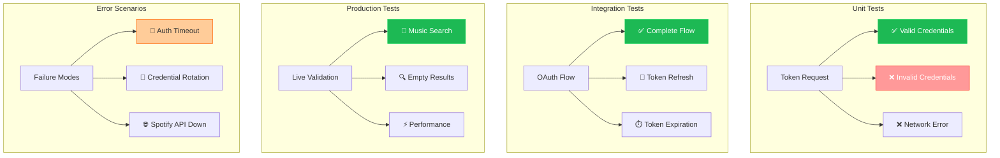

# Spotify Authentication Fix - Diagrams

## Authentication Problem vs Solution Overview

### Current Broken Authentication Flow

```mermaid
flowchart TD
    A[User searches for music] --> B[API endpoint /api/music-search]
    B --> C[SpotifyMusicService.searchMusic]
    C --> D[SpotifyClient.searchTracks]
    D --> E[SpotifyClient.refreshToken]
    
    E --> F{Token refresh}
    F -->|FAILS| G[SpotifyError: AUTH_FAILED]
    G --> H[Empty results returned]
    H --> I[User sees "no results found"]
    
    style E fill:#ff9999,stroke:#ff0000,color:#fff
    style F fill:#ff9999,stroke:#ff0000,color:#fff
    style G fill:#ff9999,stroke:#ff0000,color:#fff
    style H fill:#ff9999,stroke:#ff0000,color:#fff
    style I fill:#ff9999,stroke:#ff0000,color:#fff
```

### Target Working Authentication Flow



## OAuth2 Client Credentials Flow

### Current Implementation Issues

```mermaid
sequenceDiagram
    participant C as SpotifyClient
    participant S as Spotify API
    participant E as Environment
    
    C->>E: Read SPOTIFY_CLIENT_ID
    C->>E: Read SPOTIFY_CLIENT_SECRET
    Note over C: Credentials available ✅
    
    C->>S: POST /api/token (Client Credentials)
    Note over C,S: grant_type=client_credentials
    S-->>C: ❌ Authentication Failed
    
    Note over C: Token refresh logic broken
    C->>C: refreshToken() method fails
    C->>C: Return AUTH_FAILED error
    
    style C fill:#ff9999,stroke:#ff0000,color:#fff
    style S fill:#ffcc99,stroke:#ff6600,color:#333
```

### Target Working Implementation

```mermaid
sequenceDiagram
    participant C as SpotifyClient
    participant S as Spotify API
    participant E as Environment
    
    C->>E: Read SPOTIFY_CLIENT_ID ✅
    C->>E: Read SPOTIFY_CLIENT_SECRET ✅
    
    C->>S: POST /api/token (Client Credentials)
    Note over C,S: grant_type=client_credentials<br/>client_id=...<br/>client_secret=...
    S-->>C: ✅ {"access_token": "...", "expires_in": 3600}
    
    C->>C: Store token with expiration
    C->>S: GET /v1/search with Bearer token
    S-->>C: ✅ Enhanced music results
    
    Note over C: Auto-refresh before expiration
    C->>C: Check token expiration
    C->>S: Refresh token if needed
    
    style C fill:#1DB954,stroke:#1ed760,color:#fff
    style S fill:#1DB954,stroke:#1ed760,color:#fff
```

## Authentication State Management

### Problem: Token State Issues



### Solution: Robust Token Management



## Error Handling Strategy

### Current Poor Error Handling



### Target Robust Error Handling

```mermaid
flowchart TD
    A[Authentication Attempt] --> B{Auth Success?}
    
    B -->|Yes| C[Store Token]
    B -->|No| D{Retry Count < 3?}
    
    D -->|Yes| E[Exponential Backoff]
    E --> F[Wait 1s, 2s, 4s]
    F --> A
    
    D -->|No| G[Log Error Details]
    G --> H[Return Graceful Error]
    H --> I[User Sees: "Search temporarily unavailable"]
    
    C --> J[Make API Calls]
    J --> K[Return Music Results]
    
    style C fill:#1DB954,stroke:#1ed760,color:#fff
    style J fill:#1DB954,stroke:#1ed760,color:#fff
    style K fill:#1DB954,stroke:#1ed760,color:#fff
    style E fill:#ffcc99,stroke:#ff6600,color:#333
    style I fill:#4ecdc4,stroke:#45b7d1,color:#fff
```

## Production Validation Workflow

### Fix Validation Process



## Authentication Testing Matrix

### Test Scenarios Coverage



The diagrams illustrate the transformation from broken authentication that fails in production to robust token management with comprehensive error handling and validation.