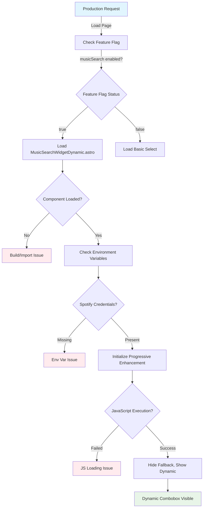
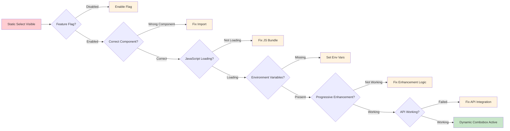
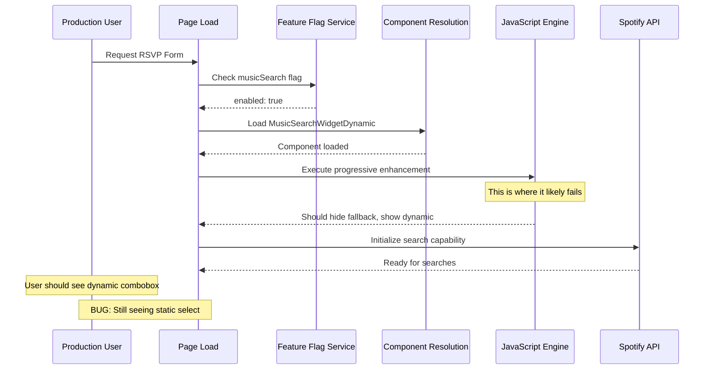

# Production Debug Flow Diagram

## Component Resolution Flow

```mermaid
graph TD
    A[Production Request] -->|Load Page| B[Check Feature Flag]
    B -->|musicSearch enabled?| C{Feature Flag Status}
    C -->|true| D[Load MusicSearchWidgetDynamic.astro]
    C -->|false| E[Load Basic Select]
    
    D --> F{Component Loaded?}
    F -->|No| G[Build/Import Issue]
    F -->|Yes| H[Check Environment Variables]
    
    H --> I{Spotify Credentials?}
    I -->|Missing| J[Env Var Issue]
    I -->|Present| K[Initialize Progressive Enhancement]
    
    K --> L{JavaScript Execution?}
    L -->|Failed| M[JS Loading Issue]
    L -->|Success| N[Hide Fallback, Show Dynamic]
    
    N --> O[Dynamic Combobox Visible]
    
    style A fill:#e1f5fe
    style O fill:#e8f5e8
    style G fill:#ffebee
    style J fill:#ffebee
    style M fill:#ffebee
```

## Debug Decision Tree

```mermaid
graph LR
    Start[Static Select Visible] --> Check1{Feature Flag?}
    Check1 -->|Disabled| Fix1[Enable Flag]
    Check1 -->|Enabled| Check2{Correct Component?}
    
    Check2 -->|Wrong Component| Fix2[Fix Import]
    Check2 -->|Correct| Check3{JavaScript Loading?}
    
    Check3 -->|Not Loading| Fix3[Fix JS Bundle]
    Check3 -->|Loading| Check4{Environment Variables?}
    
    Check4 -->|Missing| Fix4[Set Env Vars]
    Check4 -->|Present| Check5{Progressive Enhancement?}
    
    Check5 -->|Not Working| Fix5[Fix Enhancement Logic]
    Check5 -->|Working| Check6{API Working?}
    
    Check6 -->|Failed| Fix6[Fix API Integration]
    Check6 -->|Working| Success[Dynamic Combobox Active]
    
    style Start fill:#ffcdd2
    style Success fill:#c8e6c9
    style Fix1 fill:#fff3e0
    style Fix2 fill:#fff3e0
    style Fix3 fill:#fff3e0
    style Fix4 fill:#fff3e0
    style Fix5 fill:#fff3e0
    style Fix6 fill:#fff3e0
```

## Production Environment Check

```mermaid
sequenceDiagram
    participant User as Production User
    participant Page as Page Load
    participant Flag as Feature Flag Service
    participant Comp as Component Resolution
    participant JS as JavaScript Engine
    participant API as Spotify API
    
    User->>Page: Request RSVP Form
    Page->>Flag: Check musicSearch flag
    Flag-->>Page: enabled: true
    
    Page->>Comp: Load MusicSearchWidgetDynamic
    Comp-->>Page: Component loaded
    
    Page->>JS: Execute progressive enhancement
    Note over JS: This is where it likely fails
    JS-->>Page: Should hide fallback, show dynamic
    
    Page->>API: Initialize search capability
    API-->>Page: Ready for searches
    
    Note over User: User should see dynamic combobox
    Note over User,Page: BUG: Still seeing static select
```