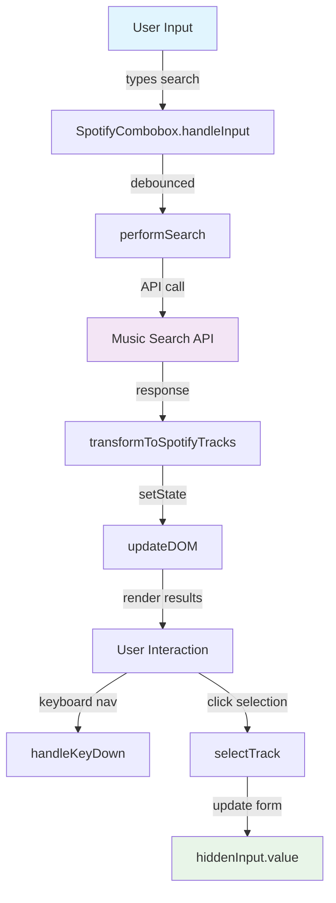
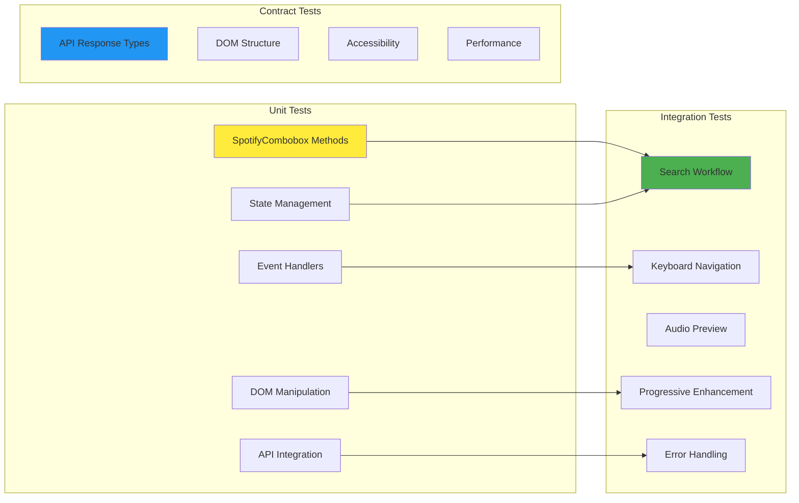
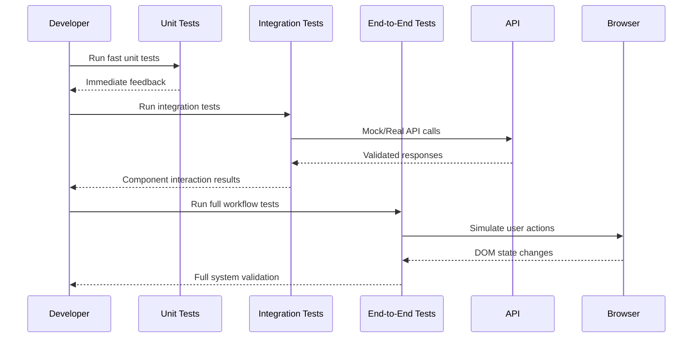

# Spotify Combobox Testing Architecture

## Test Coverage Flow

## Testing Layers

## Test Execution Strategy

## Testing Tools & Framework

- **Vitest**: Fast unit test runner
- **Testing Library**: DOM interaction testing
- **MSW**: API mocking for integration tests
- **Playwright**: End-to-end browser testing
- **TypeScript**: Type safety validation