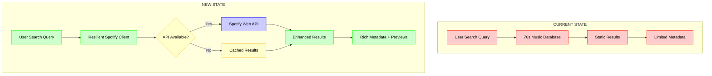
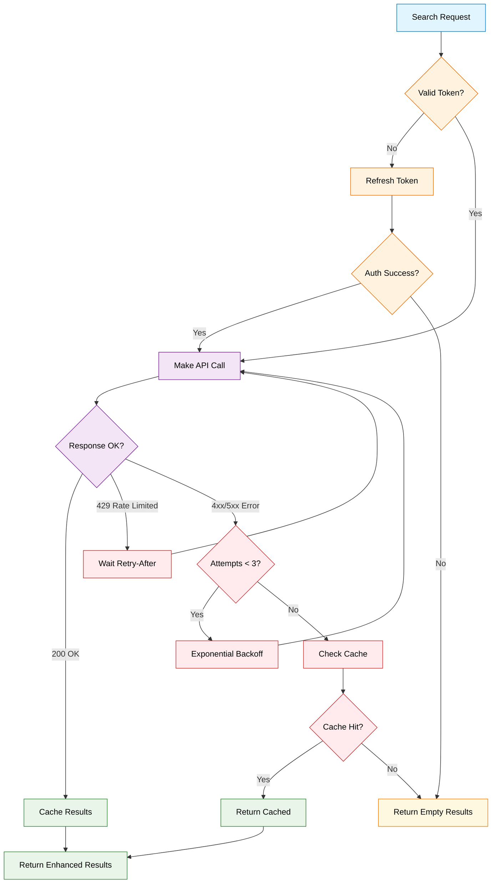
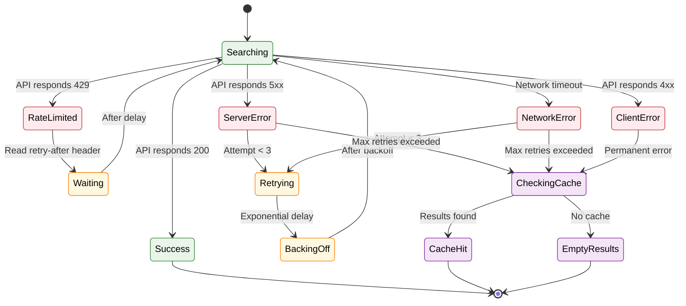

# Spotify Integration Architecture Diagrams

## Current vs New Architecture



## Resilient Client Flow with Error Handling



## Authentication Flow

```mermaid
sequenceDiagram
    participant App as Spotify Client
    participant Auth as Auth Service
    participant Spotify as Spotify API
    participant Cache as Token Cache
    
    App->>Auth: Request Access Token
    Auth->>Cache: Check Token Cache
    Cache-->>Auth: Token Expired/Missing
    Auth->>Spotify: Client Credentials Request
    Note over Auth,Spotify: POST /api/token<br/>grant_type=client_credentials
    Spotify-->>Auth: Access Token + Expires
    Auth->>Cache: Store Token with TTL
    Auth-->>App: Valid Access Token
    
    App->>Spotify: Search Request with Token
    alt Token Valid
        Spotify-->>App: Search Results
    else Token Expired
        Spotify-->>App: 401 Unauthorized
        App->>Auth: Refresh Token (Auto)
        Auth->>Spotify: New Client Credentials Request
        Spotify-->>Auth: New Access Token
        Auth->>Cache: Update Token Cache
        Auth-->>App: New Valid Token
        App->>Spotify: Retry Search Request
        Spotify-->>App: Search Results
    end
    
    classDef app fill:#e3f2fd,stroke:#1976d2,color:#000
    classDef auth fill:#fff3e0,stroke:#ef6c00,color:#000
    classDef spotify fill:#e8f5e8,stroke:#2e7d32,color:#000
    classDef cache fill:#fff8e1,stroke:#f57c00,color:#000
    
    class App app
    class Auth auth
    class Spotify spotify
    class Cache cache
```

## Caching Strategy

```mermaid
graph TB
    REQUEST[Search Request] --> MEMORY{Memory Cache?}
    MEMORY -->|Hit| RETURN[Return Cached Results]
    MEMORY -->|Miss| API[Call Spotify API]
    
    API --> RESPONSE{Response?}
    RESPONSE -->|Success| STORE[Store in Memory Cache]
    RESPONSE -->|Error| EMPTY[Return Empty Results]
    
    STORE --> TTL[Set 5-minute TTL]
    TTL --> RETURN
    
    subgraph "Memory Cache Structure"
        MC[Map<string, CacheEntry>]
        CE[CacheEntry: {results, expires}]
        MC --> CE
    end
    
    subgraph "Cache Policies"
        P1[TTL: 5 minutes for search results]
        P2[TTL: 1 hour for access tokens]
        P3[Size: No hard limit - hobby app]
        P4[Eviction: TTL-based only]
    end
    
    classDef request fill:#e1f5fe,stroke:#0277bd,color:#000
    classDef cache fill:#fff8e1,stroke:#f57c00,color:#000
    classDef api fill:#e8f5e8,stroke:#2e7d32,color:#000
    classDef policy fill:#f3e5f5,stroke:#7b1fa2,color:#000
    classDef structure fill:#fff3e0,stroke:#ef6c00,color:#000
    
    class REQUEST request
    class MEMORY,STORE,TTL,RETURN cache
    class API,RESPONSE api
    class P1,P2,P3,P4 policy
    class MC,CE structure
```

## Component Architecture

```mermaid
graph TB
    subgraph "API Layer"
        ENDPOINT[/api/music-search]
    end
    
    subgraph "Service Layer"
        CLIENT[SpotifyClient]
        AUTH[AuthService]
        CACHE[CacheService]
    end
    
    subgraph "Infrastructure"
        MEMORY[Memory Cache]
        ENV[Environment Config]
    end
    
    subgraph "External"
        SPOTIFY[Spotify Web API]
    end
    
    ENDPOINT --> CLIENT
    CLIENT --> AUTH
    CLIENT --> CACHE
    CLIENT --> SPOTIFY
    
    AUTH --> ENV
    AUTH --> MEMORY
    CACHE --> MEMORY
    
    classDef api fill:#e3f2fd,stroke:#1976d2,color:#000
    classDef service fill:#fff3e0,stroke:#ef6c00,color:#000
    classDef infra fill:#f3e5f5,stroke:#7b1fa2,color:#000
    classDef external fill:#e8f5e8,stroke:#2e7d32,color:#000
    
    class ENDPOINT api
    class CLIENT,AUTH,CACHE service
    class MEMORY,ENV infra
    class SPOTIFY external
```

## Error Scenarios and Recovery



## Data Flow and Enhancement

```mermaid
flowchart LR
    INPUT[User Query: "Beatles"] --> SPOTIFY[Spotify Search API]
    
    subgraph "Raw Spotify Response"
        RAW[Track Object]
        FIELDS["• name\n• artists[]\n• album{}\n• preview_url\n• popularity\n• id"]
    end
    
    subgraph "Enhanced Output"
        ENHANCED[Enhanced Track]
        OUTPUT["• title\n• artist\n• album\n• year\n• preview_url\n• spotify_id\n• popularity\n• image_url"]
    end
    
    SPOTIFY --> RAW
    RAW --> FIELDS
    FIELDS --> TRANSFORM[Transform Function]
    TRANSFORM --> ENHANCED
    ENHANCED --> OUTPUT
    
    classDef input fill:#e1f5fe,stroke:#0277bd,color:#000
    classDef spotify fill:#e8f5e8,stroke:#2e7d32,color:#000
    classDef raw fill:#fff3e0,stroke:#ef6c00,color:#000
    classDef enhanced fill:#f3e5f5,stroke:#7b1fa2,color:#000
    classDef transform fill:#fff8e1,stroke:#f57c00,color:#000
    
    class INPUT input
    class SPOTIFY spotify
    class RAW,FIELDS raw
    class ENHANCED,OUTPUT enhanced
    class TRANSFORM transform
```