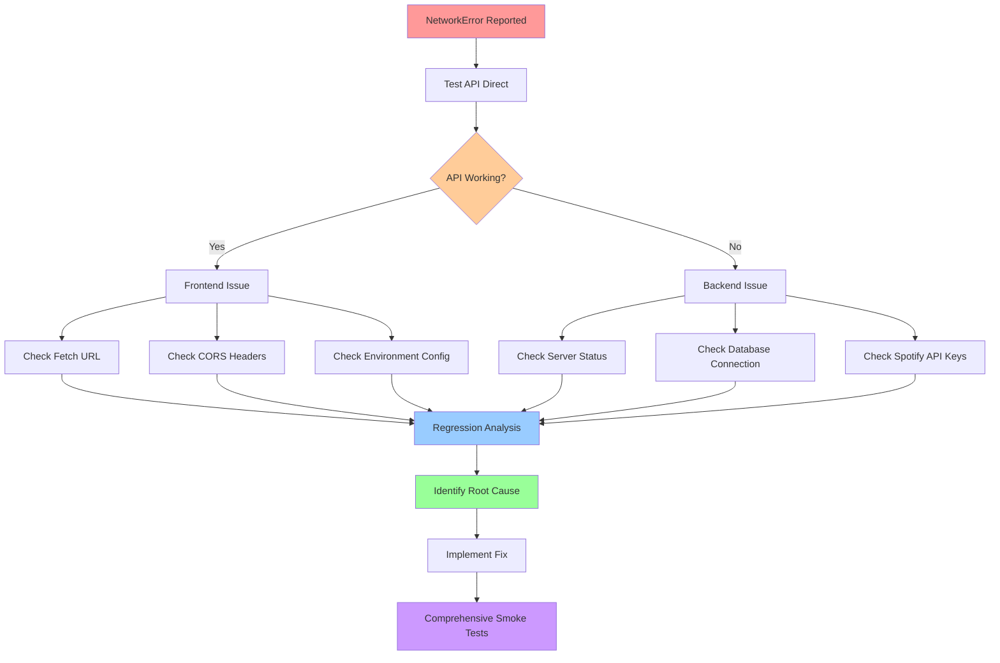
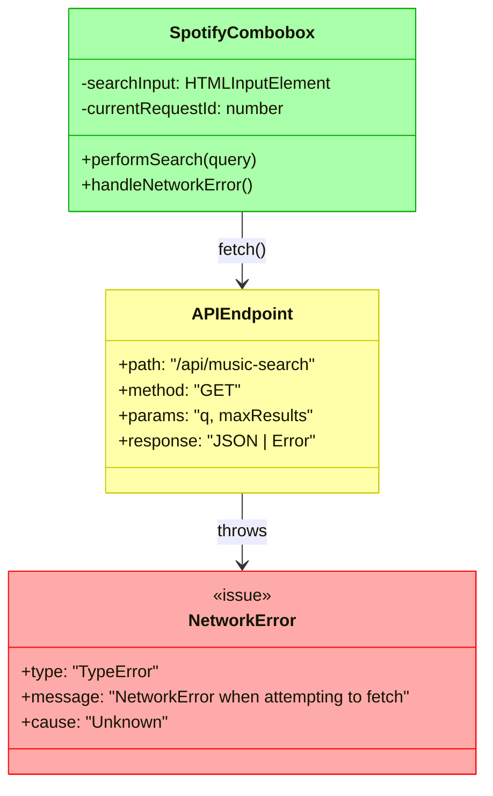

# Spotify Network Error Debug - Diagrams

## Current Problem Flow

```mermaid
sequenceDiagram
    participant U as User
    participant C as Combobox
    participant A as API Endpoint
    
    U->>C: Types search query
    C->>C: Debounce 200ms
    C->>A: fetch('/api/music-search?q=...')
    A-->>C: NetworkError ❌
    C->>C: Log "Search failed"
    C-->>U: No results shown
    
    style A fill:#ffcccc,stroke:#ff0000
    style C fill:#fff2cc,stroke:#d6b656
    
    Note over C,A: TypeError: NetworkError when<br/>attempting to fetch resource
```

## Expected Working Flow

```mermaid
sequenceDiagram
    participant U as User
    participant C as Combobox  
    participant A as API Endpoint
    participant S as Spotify API
    
    U->>C: Types search query
    C->>C: Debounce 200ms
    C->>A: fetch('/api/music-search?q=...')
    A->>S: Search Spotify
    S-->>A: Song results
    A-->>C: JSON response ✅
    C->>C: Transform results
    C-->>U: Show dropdown with songs
    
    style A fill:#ccffcc,stroke:#00ff00
    style C fill:#e6f3ff,stroke:#0066cc
    style S fill:#90EE90,stroke:#006400
```

## Debugging Investigation Flow



## Network Request Analysis



## Environment Comparison

```mermaid
graph LR
    subgraph Local["Local Environment"]
        L1[localhost:4321]
        L2[/api/music-search]
        L3[PostgreSQL Docker]
        L1 --> L2
        L2 --> L3
        style L1 fill:#e6ffe6
        style L2 fill:#e6ffe6  
        style L3 fill:#e6ffe6
    end
    
    subgraph Production["Production (Railway)"]
        P1[yait.social]
        P2[/api/music-search]
        P3[Railway PostgreSQL]
        P1 --> P2
        P2 --> P3
        style P1 fill:#ffe6e6
        style P2 fill:#ffe6e6
        style P3 fill:#ffe6e6
    end
    
    subgraph Browser["Browser Request"]
        B1[SpotifyCombobox.ts]
        B2[fetch('/api/music-search')]
        B1 --> B2
        style B1 fill:#fff2e6
        style B2 fill:#fff2e6
    end
    
    B2 -.->|Working?| L2
    B2 -.->|NetworkError| P2
    
    Note1[Local: Works ✅]
    Note2[Production: Broken ❌]
    
    style Note1 fill:#90EE90
    style Note2 fill:#FFB6C1
```