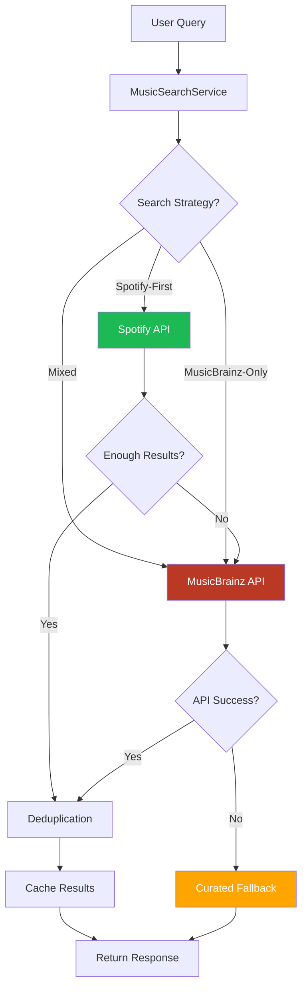
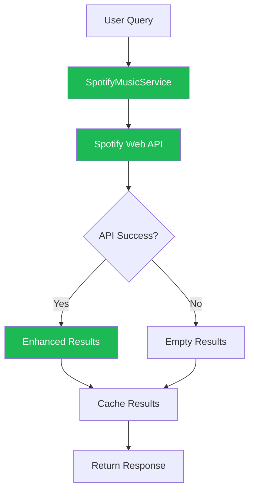
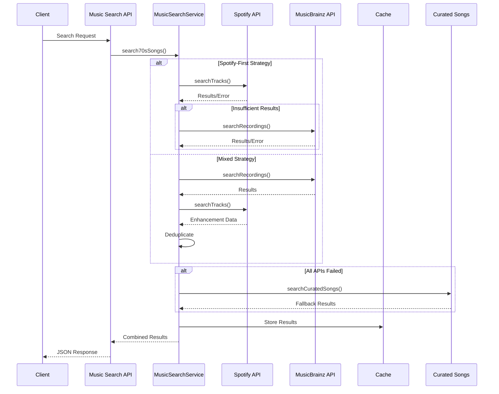
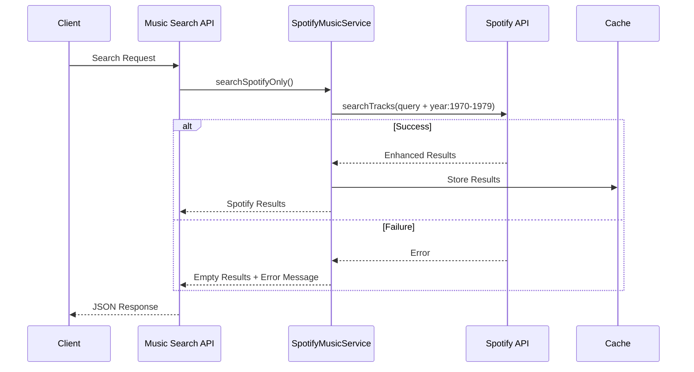
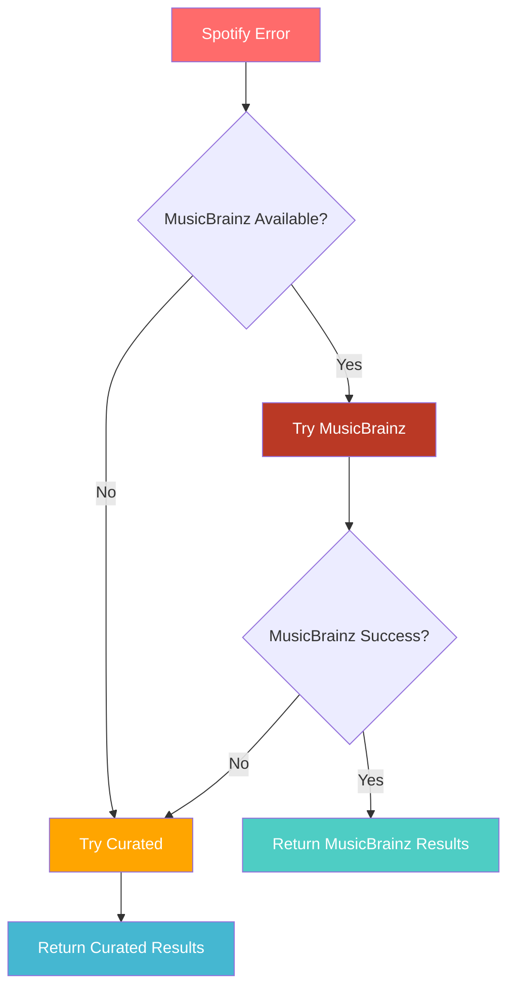
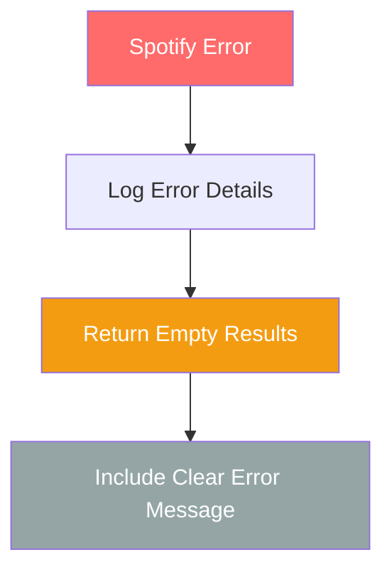
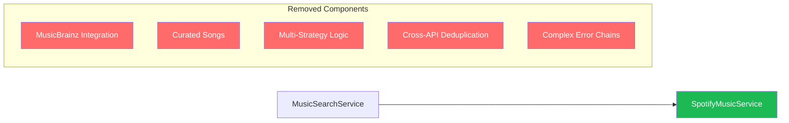
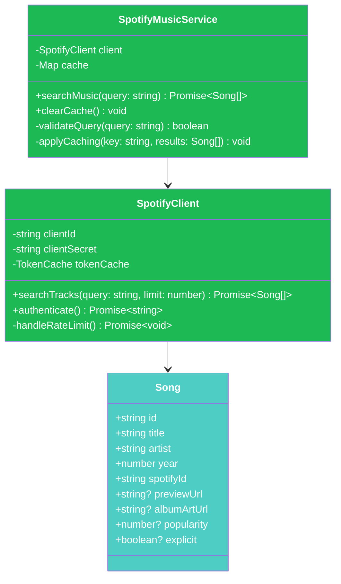

# Spotify-Only Search Architecture Diagrams

## Current vs Simplified Architecture

### Before: Multi-Source Architecture

### After: Spotify-Only Architecture

## Data Flow Simplification

### Current Data Flow (Complex)

### Simplified Data Flow (Spotify-Only)

## Error Handling Comparison

### Current: Complex Fallback Chain

### Simplified: Clean Error Response

## Component Removal Map

### Services to Remove

## Simplified Class Structure

### New Clean Architecture

## Performance Benefits

### Before vs After Response Times

```mermaid
gantt
    title API Response Time Comparison
    dateFormat X
    axisFormat %Lms
    
    section Current Multi-Source
    Spotify Call     :active, a1, 0, 800
    MusicBrainz Call :a2, 800, 1800
    Deduplication    :a3, 1800, 2000
    Cache Store      :a4, 2000, 2100
    
    section Simplified Spotify-Only
    Spotify Call :done, b1, 0, 600
    Cache Store  :done, b2, 600, 650
```

The diagrams show a significant architectural simplification that removes complexity while maintaining the core music discovery functionality through Spotify's comprehensive catalog.