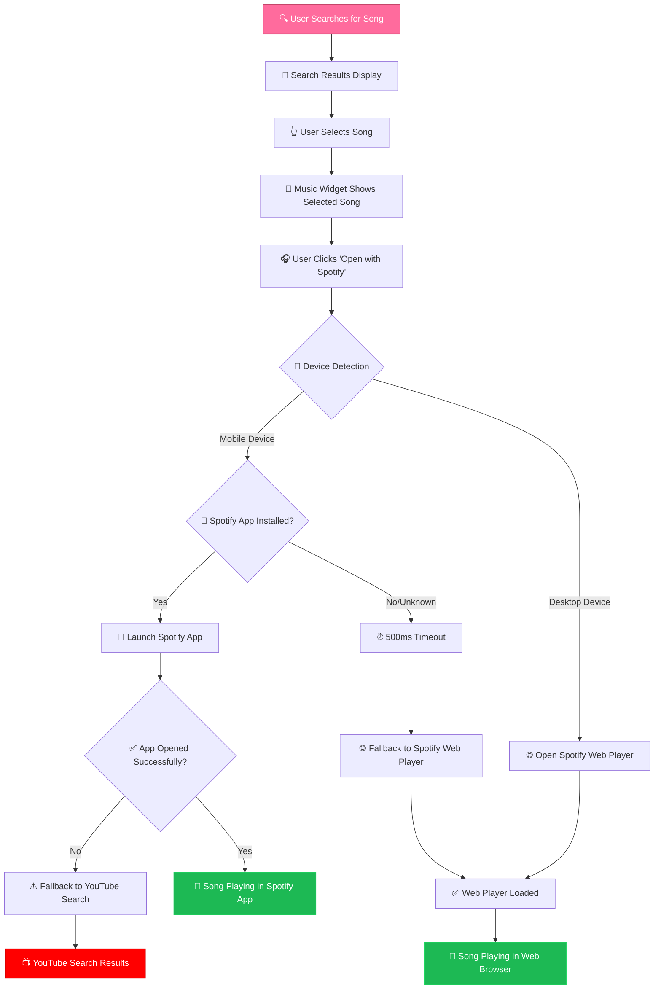
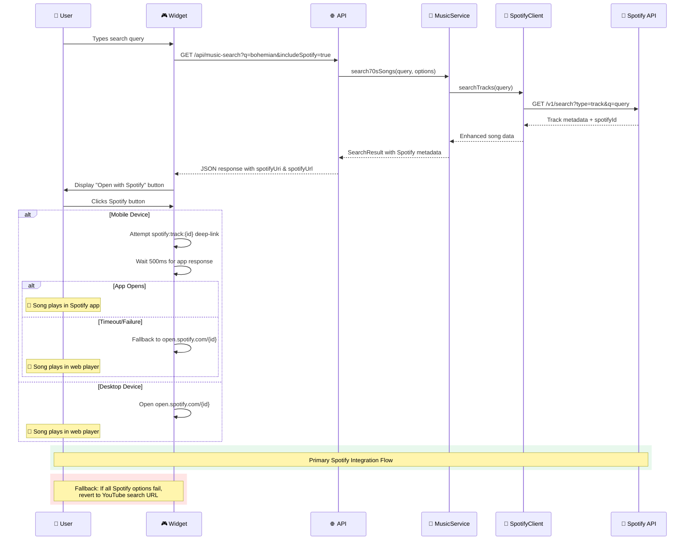
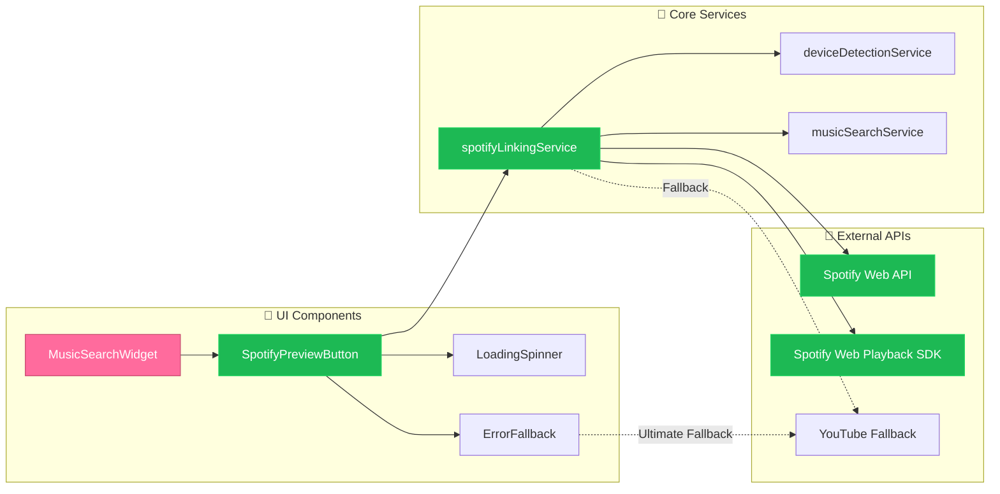
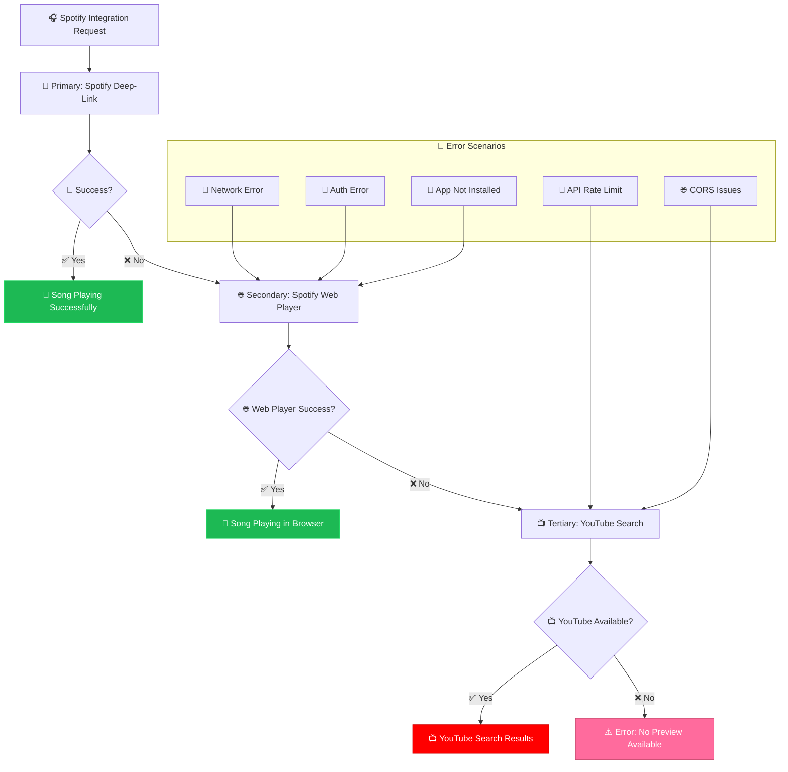
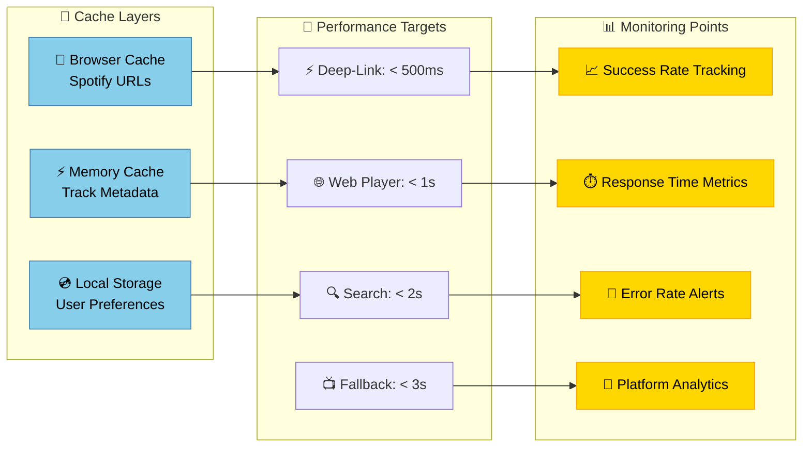

# Spotify Preview Integration - Technical Diagrams

## User Journey Flow



## System Architecture

```mermaid
graph TB
    subgraph "🎮 Frontend Layer"
        A[MusicSearchWidget.astro] --> B[SpotifyPreview Component]
        B --> C[spotifyLinkingService.ts]
    end
    
    subgraph "🔧 Service Layer" 
        C --> D[musicSearchService.ts]
        D --> E[SpotifyClient]
        D --> F[YouTubePlayerService]
    end
    
    subgraph "🌐 API Layer"
        G[/api/music-search] --> D
        E --> H[Spotify Web API]
        F --> I[YouTube Data API]
    end
    
    subgraph "💾 Data Flow"
        J[User Search Query] --> G
        G --> K[Enhanced Song Data]
        K --> L[Spotify Metadata]
        K --> M[YouTube Fallback]
    end
    
    subgraph "📱 Platform Integration"
        N[Deep Link Handler] --> O[spotify:// URIs]
        N --> P[open.spotify.com URLs]
        Q[Web Playback SDK] --> P
    end
    
    C --> N
    B --> Q
    
    style A fill:#ff6b9d,stroke:#c44569,color:#fff
    style B fill:#1db954,stroke:#1ed760,color:#fff
    style E fill:#1db954,stroke:#1ed760,color:#fff
    style H fill:#1db954,stroke:#1ed760,color:#fff
    style O fill:#1db954,stroke:#1ed760,color:#fff
    style P fill:#1db954,stroke:#1ed760,color:#fff
```

## API Data Flow



## Component Interaction Architecture



## Deep-Link Decision Tree

```mermaid
flowchart TD
    A[🎧 User Clicks 'Open with Spotify'] --> B{📱 Platform Detection}
    
    B -->|📱 Mobile| C{🔍 User Agent Analysis}
    B -->|🖥️ Desktop| D[🌐 Direct to Spotify Web Player]
    
    C -->|📱 iOS| E[🍎 iOS Deep-Link Strategy]
    C -->|🤖 Android| F[🤖 Android Deep-Link Strategy] 
    C -->|❓ Unknown| G[🌐 Safe Web Fallback]
    
    E --> H[🚀 Try: spotify:track:{id}]
    F --> I[🚀 Try: spotify:track:{id}]
    
    H --> J[⏰ 1000ms Timeout]
    I --> K[⏰ 500ms Timeout]
    
    J --> L{✅ App Responded?}
    K --> M{✅ App Responded?}
    
    L -->|✅ Yes| N[🎵 Success: Song in Spotify App]
    L -->|❌ No| O[🌐 Fallback: open.spotify.com]
    
    M -->|✅ Yes| P[🎵 Success: Song in Spotify App] 
    M -->|❌ No| Q[🌐 Fallback: open.spotify.com]
    
    D --> R[🌐 open.spotify.com/{id}]
    G --> R
    O --> R
    Q --> R
    
    R --> S{🌐 Web Player Loads?}
    S -->|✅ Yes| T[🎵 Success: Song in Web Player]
    S -->|❌ No| U[⚠️ Ultimate Fallback: YouTube Search]
    
    style A fill:#ff6b9d,stroke:#c44569,color:#fff
    style N fill:#1db954,stroke:#1ed760,color:#fff
    style P fill:#1db954,stroke:#1ed760,color:#fff
    style T fill:#1db954,stroke:#1ed760,color:#fff
    style U fill:#ff0000,stroke:#cc0000,color:#fff
```

## Error Handling & Fallback Strategy



## Performance & Caching Strategy

