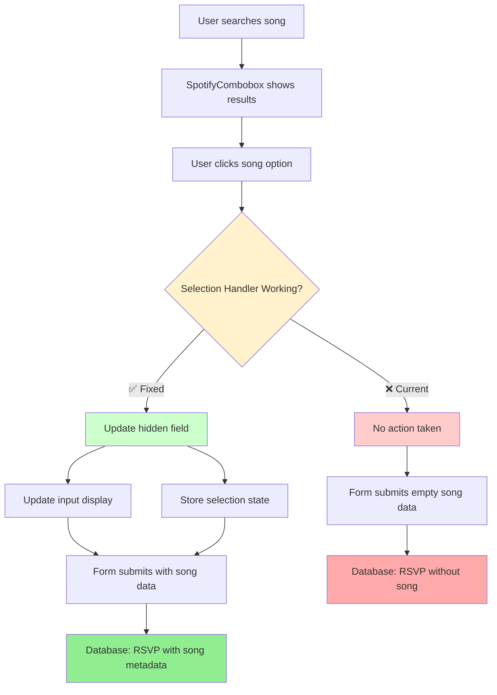
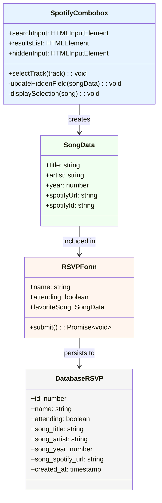
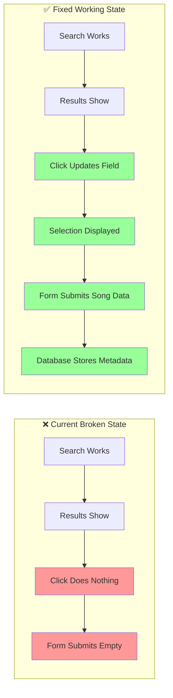
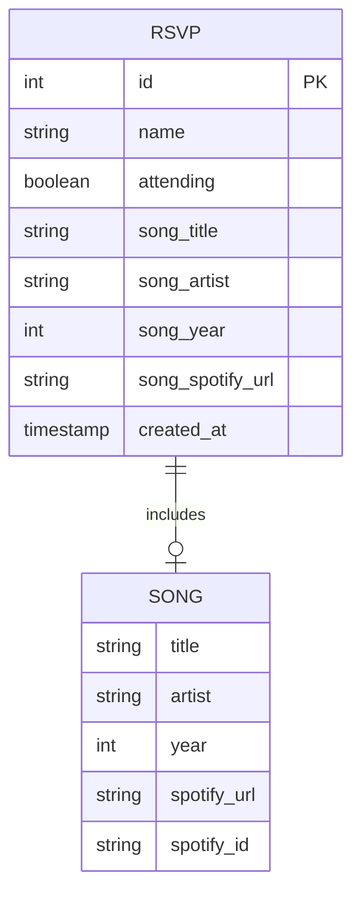
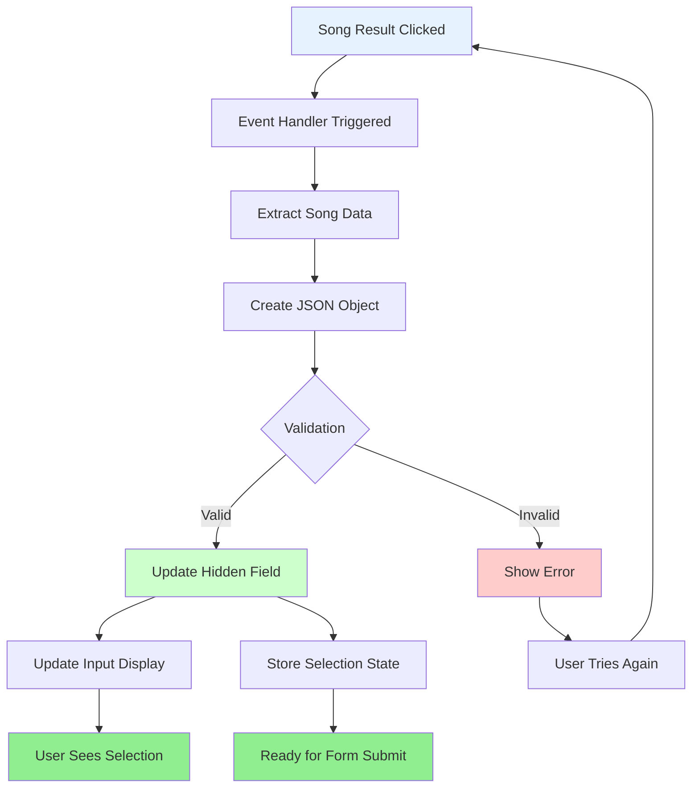

# Spotify RSVP Integration Fix - Diagrams

## Current Broken Flow

```mermaid
sequenceDiagram
    participant U as User
    participant C as Combobox
    participant H as Hidden Field
    participant F as RSVP Form
    participant D as Database
    
    U->>C: Types search query
    C->>C: Shows dropdown results
    U->>C: Clicks song option
    C--xH: ❌ Selection not saved
    Note over H: Hidden field remains empty
    U->>F: Submits RSVP form
    F->>D: Saves RSVP without song data
    
    style C fill:#ffcccc,stroke:#ff0000
    style H fill:#ffaaaa,stroke:#ff0000
    Note over U,D: Song selection lost!
```

## Expected Working Flow

```mermaid
sequenceDiagram
    participant U as User
    participant C as Combobox
    participant H as Hidden Field
    participant F as RSVP Form
    participant D as Database
    
    U->>C: Types search query
    C->>C: Shows dropdown results
    U->>C: Clicks song option
    C->>H: ✅ Updates hidden field with JSON
    C->>C: Shows selected song in input
    U->>F: Submits RSVP form
    F->>F: Validates song data
    F->>D: Saves RSVP with complete song metadata
    
    style C fill:#ccffcc,stroke:#00aa00
    style H fill:#90EE90,stroke:#006400
    style D fill:#90EE90,stroke:#006400
    Note over U,D: Complete song data saved!
```

## Component Integration Flow



## Data Flow Architecture



## Current vs Fixed State Comparison



## Database Schema Enhancement



## Event Handler Fix Flow

