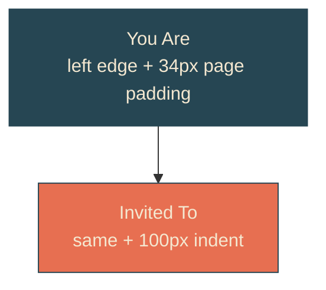

# staggered-headline

## Verbatim request (2026-06-12)

> can we move the text to be left aligned on the page? and break it into two
> segments so that "You Are" is on top and "invited to" is below, but "invited to"
> is indented in by 100px pushing it to the right a little bit?

## Confirmed understanding

The headline becomes a left-aligned two-line lockup: "You Are" on line one,
"Invited To" on line two (current capitalization kept), with line two indented
exactly 100px. Same Shrikhand sizing, same stern-locked reveal. Side benefit: the
text now lives in the left half of the page, so the stern passes it earlier and the
previously back-loaded tail finishes sooner.

## Layout at a glance

## Plan

1. `heroScene.ts`: `HEADLINE_LINES = [['You', 'Are'], ['Invited', 'To']]` exported —
   the component maps lines and words from data rather than hardcoding structure.
2. Canaries/tests (failure-first): yait-scene canary locks the flattened lines to
   the four words in order; CSS canary locks `.headline-line-indent` to exactly
   100px; e2e asserts geometrically that line two's bounding left equals line one's
   bounding left plus 100 (within tolerance).
3. Markup/CSS: `.headline` goes left-aligned with page padding; two `.headline-line`
   block spans, the second with `.headline-line-indent`; words stay `.word` spans so
   every existing content assertion holds. Reveal animations untouched.
4. Validate locally (suites, docked and mid-sail frames at both viewports, curl
   markers), deploy with sentinel = compiled stylesheet containing
   "headline-line-indent", forensics pre/post.

### PR checklist pass

Line structure is data beside the rest of the scene config; indent is a style rule
(no inline styles); nothing duplicated; no comments; covered by canary, integration,
and a geometric e2e.
