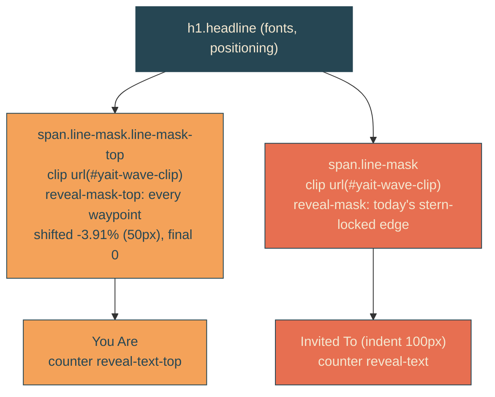

# staggered-line-reveal

## Verbatim request (2026-06-12)

> nice. Can we make it so we have 2 reveal lines just like this, but one for the top
> that is behind the one for the bottom line by about 50px to the left of the
> bottom's line? so the bottom gets revealed slightly first

## Confirmed understanding

The single reveal splits into two: each headline line gets its own wavy 45-degree
edge. The bottom line ("Invited To") keeps today's stern-locked edge exactly; the
top line ("You Are") trails 50px to the left throughout the sweep, so the bottom
reveals slightly first, and both edges converge during the settle so the lockup
finishes together. The stagger ships as a fraction of the mask width, so it scales
to about 15px on phones.

## Structure and geometry

Per-line clip geometry: each mask box is one line tall (~143px at reference), so
WAVE_GEOMETRY rescales to slantPx = maskH = 143 (the same 45 degrees), 4 periods
(the same ~50px wavelength), 12.5px amplitude unchanged. One shared clipPath serves
both lines.

## Plan

1. `heroScene.ts`: WAVE_GEOMETRY rescaled per line (143/143/4/32, 45-degree
   invariant slantPx === maskH); `REVEAL_STAGGER_PX = 50`;
   `staggerRevealEdge(edge, staggerPx, viewportW)` shifting every non-final
   waypoint left by the stagger fraction, final waypoint untouched (convergence);
   `REVEAL_EDGE_TOP` and `REVEAL_EDGE_TOP_MOBILE` exported.
2. Unit tests (failure-first): stagger shifts each non-final percent by exactly
   -3.90625, preserves offsets and monotonicity, final stays 0; 45-degree
   invariant; wave tests re-derive against the rescaled geometry.
3. Markup/CSS: each `.headline-line` wraps in a `.line-mask` block (overflow,
   clip, reveal-mask animation); top variants swap animation-name; the old
   single-mask animation comes off `.headline-mask` (it remains the positioning
   wrapper) and `reveal-text` moves to `.headline-line`. Keyframes: top variants
   desktop and mobile from the staggered edges (8 blocks total, canary-locked).
4. E2E: clip/slant probes retarget `.line-mask` (two expected); the stern-lock
   test pins the bottom mask; a new stagger test asserts the bottom mask's right
   edge leads the top's by 45-55px at a pinned mid-sail clock and that both are
   fully revealed at rest (reduced-motion check covers the converged end state).
5. Validate locally (suites, frames), deploy with sentinel = prod CSS containing
   "reveal-mask-top", forensics pre/post.

### PR checklist pass

The stagger derivation is one pure function beside the edge it derives from; all
rules in yait.css; keyframe variants generated from one source (canary-locked, not
hand-forked values); no comments; unit + canary + integration + e2e cover it.
