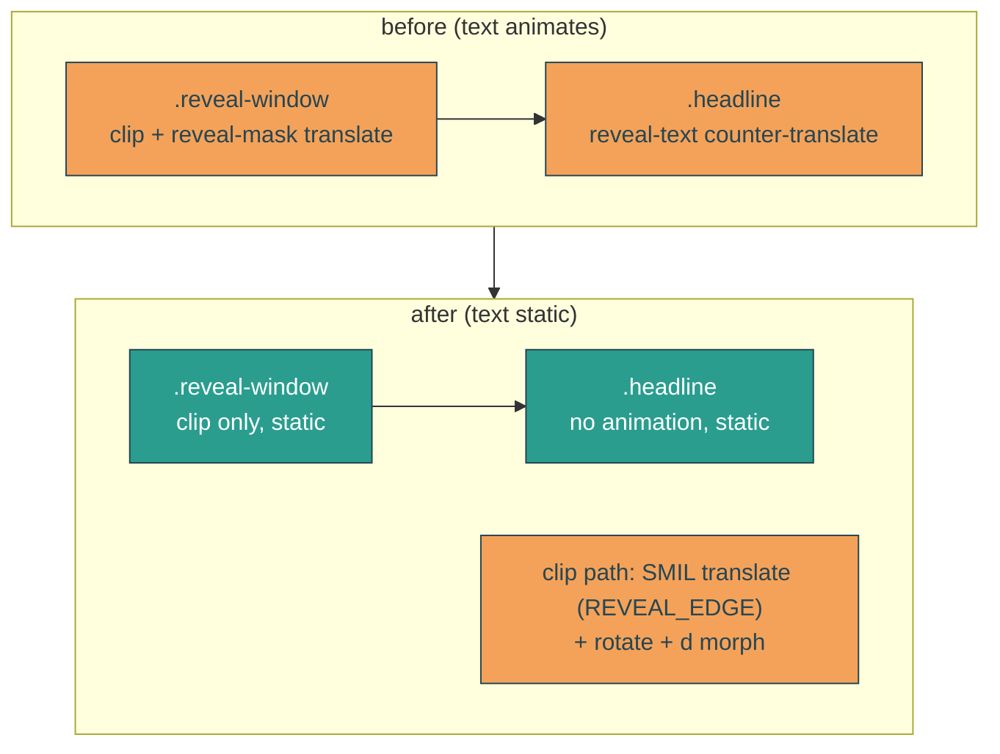

# static-headline-text

## Verbatim request (2026-06-14)

> is there an animation directly on the text elements? the text itself should have
> zero animation
> [confirmed: remove it from the text; desktop sweep values, accept mobile drift]

## Finding

The `.headline` (the `<h1>` holding the words) has `animation: reveal-text` - a
counter-translation that cancels the `.reveal-window`'s `reveal-mask` translate. The net
visual is already static (measured: the word's left edge stays at 34px throughout), but
the text element technically animates (a +/-1572px counter-translation that relies on
two elements being the same width).

## Decision

Make the text element carry zero animation. Keep `.headline` and `.reveal-window`
static; move the reveal sweep onto the wave aperture itself - a SMIL `translate` on the
clip path, using the same `REVEAL_EDGE` values, composed additively with the existing
rotate and `d` morph. Mathematically equivalent to today's net visual, but the text is
genuinely unanimated and the reveal no longer depends on two transforms cancelling.

## Why SMIL on the clip (de-risked by experiment)

- CSS transform animation on a clipPath child: does NOT work in Chromium (measured 0%).
- SMIL `<animateTransform type="translate">` on the clip path: works (measured 4.8%).
- Consequence: SMIL can't be media-queried, so the sweep uses one value set (desktop
  `REVEAL_EDGE`). Mobile still fully reveals; its tracking of the mobile boat is
  approximate (~15% off). Accepted.

## Reduced motion

`home.astro` strips all `animate` / `animateTransform`, so the clip rests at frame 0
with no translate - which reveals the full text (same as today's reduced-motion docked
state). The text was already static. No change needed there.

## Out of scope

Boat sail/weave, envelope, clouds, sun/sea, the wave morph shape and the cut-line
rotate (both kept). Pixel-perfect mobile reveal tracking (accepted as approximate).

## Validation

To validate static-headline-text I can confirm `getComputedStyle('.headline').animationName`
is `none`; confirm the word glyph is byte-identical from early in the reveal to docked
(text never moves); confirm the reveal still completes (all words opacity 1, CTA up);
confirm the clip path carries a `translate` animateTransform whose values come from
`REVEAL_EDGE` (so it tracks the stern by construction); and screenshot mid-sail and
docked to confirm the wave still sweeps the text in. Reduced motion still shows the
full docked text.
