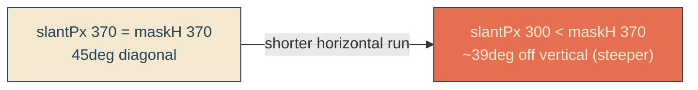

# steeper-reveal-slant

## Verbatim request (2026-06-13)

> can we tilt the line more upwards where the angle is just a bit more up and down?
> but not by too much

## Confirmed understanding

Tilt the reveal cut line a bit more vertical ("up and down"), modestly. It is a
45-degree diagonal today; make it steeper by shortening its horizontal run while
keeping its height: `WHIP_GEOMETRY.slantPx` 370 -> 300 (with `maskH` 370), so the
slant goes from 45 degrees to about 39 degrees off vertical - clearly more upright but
still clearly slanted.

## Mechanism

One constant: `WHIP_GEOMETRY.slantPx` 370 -> 300. The whip path, bump, and cut-edge
rotation all derive from `WHIP_GEOMETRY`, so they follow. Amplitude (50), maskH (370),
width, samples unchanged.

## Validation

To validate steeper-reveal-slant I can confirm the rendered reveal edge is more
vertical (slant horizontal-to-height ratio ~0.81 instead of 1.0) and a single whip
bump still rides it, with letters revealed normally.

## Out of scope

Amplitude, the whip morph cadence, the cut-edge rotation amount, reveal/sail timing,
clouds, envelope.
