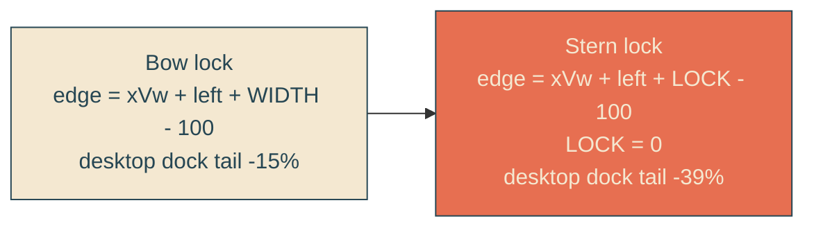

# stern-locked-reveal

## Verbatim request (2026-06-12)

> can we actually have the stern of the boat be the point of reveal instead of the
> bow?

## Confirmed understanding

The reveal edge moves from the bow to the stern: letters appear only where the whole
boat has already passed — true wake behavior. Accepted consequence (confirmed): the
boat docks with its stern at 61 percent of the viewport, so the final ~39 percent of
the headline sweeps out during the 1-second dock settle at roughly double the sail
pace, completing as the boat rests.

## The one-line geometry change

Waypoints become: desktop -131 / -91 / -55 / -39 / 0; mobile -146 / -106 / -70 /
-46 / 0 (same rescaled offsets, settle still finishes at 100 percent).

## Plan

1. `heroScene.ts`: `HullGeometry.lockVw` replaces the implicit bow lock
   (`REVEAL_LOCK_VW = 0` = stern; bow would be hull width). Derivations pass the
   stern lock; width constants remain as hull documentation.
2. Unit tests (failure-first): formula per waypoint = xVw + left + lock - 100; both
   edges start at or beyond -100 (nothing revealed until the stern enters); settle
   tail bound loosened to the stern geometry (<= 50).
3. Canary: unchanged logic — it re-locks the four keyframe blocks to the new
   REVEAL_EDGE values once the stylesheet is updated.
4. E2E: the geometric lock flips — mask bounding right edge equals the track's
   bounding LEFT edge (within tolerance) at three pinned clock times.
5. Validate locally (suites, beat frames), deploy with sentinel = compiled
   stylesheet containing the new -91% waypoint ("translateX(-91%)" compiles intact),
   forensics pre/post.

### PR checklist pass

Single-parameter extension of the existing derivation (no duplication, right home);
all rules in yait.css; typed pure function; no comments; unit + canary + e2e updated
in step.
