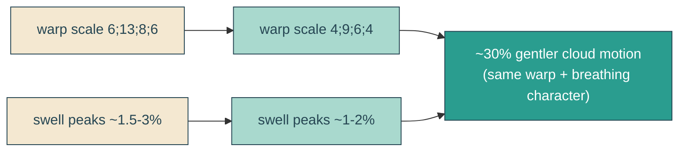

# subtler-cloud-motion

## Verbatim request (2026-06-14)

> can we make the cloud animations a little bit more subtle?
> [chosen: reduce both the warp and the breathing, modestly]

## Confirmed understanding

The hero clouds currently move at ~9.8% changed-pixels per cycle in the sky band.
Reduce both motion sources by roughly a third, keeping the same character (edge warp
+ layered breathing) but gentler. No shape, palette, placement, or reduced-motion
change.

## Mechanism

Two amplitude knobs, both eased ~30% toward rest:

- Edge warp: `feDisplacementMap` `scale` values (`6;13;8;6` -> `4;9;6;4`). The
  turbulence `baseFrequency` (texture, not amplitude) is unchanged.
- Layered breathing: the `swell-tall` / `swell-flat` keyframe scale peaks pulled ~30%
  closer to `1.0`.

## Out of scope

Cloud shapes (`cloudArt.ts`), palette, placement, sky, and the reduced-motion rest all
stay. Only animation amplitudes change (warp `scale` values + breathing keyframe peaks).

## Validation

To validate subtler-cloud-motion I can rebuild, screenshot two hero frames ~2.3s apart
and confirm the sky-band changed-pixel percentage drops meaningfully below the prior
~9.8% (but stays clearly non-zero), confirm reduced motion still rests the clouds, and
eyeball that the warp + breathing character is unchanged, just softer.
