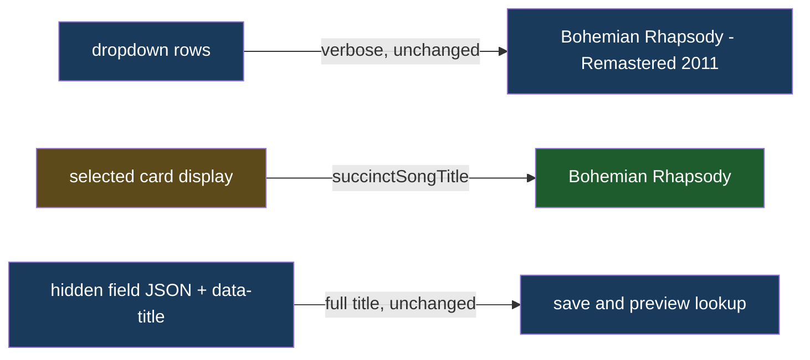

# Succinct Selected Card

## Understanding

The modal's selected song card shows Spotify's verbose title. It should display the succinct
title via the existing `succinctSongTitle` rule, matching the guest cards. The dropdown rows
stay verbose so guests can distinguish versions while picking, and the full title continues
to be saved with the RSVP and carried in the play button's data attributes for preview lookup.

## Outcome

- `renderTrackContent` gains an optional display title (defaulting to the track's full
  title); `renderSelection` passes the succinct form. Dropdown rendering is untouched.
- One shared rule (`src/lib/songTitle.ts`) now serves both surfaces; no duplication.
- Locked by selected-state unit tests asserting succinct display on the card, verbose
  display in the dropdown, and the full title in the hidden field and data attributes.
- Deployed to production once verified locally.
