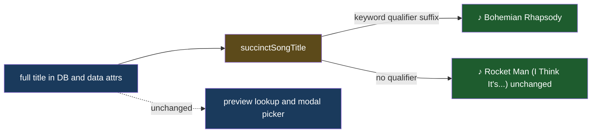

# Succinct Song Title

## Understanding

Spotify track titles often carry version qualifiers — "Bohemian Rhapsody - Remastered 2011",
"Le Freak - 2018 Remaster", "September (2009 Remaster)". Guest cards should display the
succinct song name only. The full title remains everywhere it has meaning: in the database,
in the play button's data attributes (the iTunes lookup matches on the full title), and in
the modal picker where guests distinguish versions.

## Stripping rules

Display-time only, keyword-gated so legitimate punctuation survives:

- A trailing " - <segment>" or trailing "(<segment>)" / "[<segment>]" is removed only when
  the segment contains a version keyword (remaster/remastered, version, edit, mix, remix,
  live, mono, stereo, single, radio, deluxe, anniversary, demo, bonus, re-recorded,
  acoustic, instrumental, from).
- Stacked qualifiers strip repeatedly ("Song - Live - 2011 Remaster" → "Song").
- Titles that are nothing but a qualifier, or where stripping would empty the string, are
  left as-is.

## Outcome

- Guest cards show the succinct name; storage, lookup, and the picker keep full titles.
- The rule lives in a small pure `src/lib/songTitle.ts` module with table-driven unit
  tests, consumed by `GuestListRenderer` for the visible span only.
- Deployed to production once verified locally.
