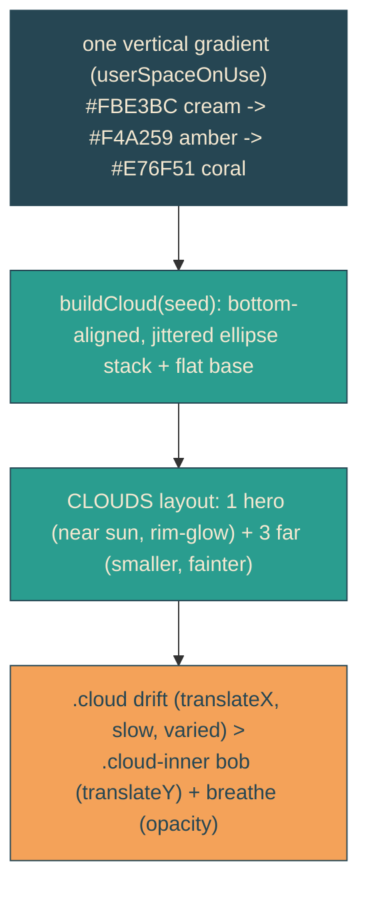

# sunset-clouds

## Verbatim request (2026-06-13)

> can we do some research on how to do some delightful sunset clouds?
> [research done; chosen: Full delight (drift + breathe)]

## Research synthesis (sources in the plan)

- Shape: drop uniform "pills" for a puffy mass of overlapping ellipses on a flat
  bottom, with UNEQUAL (jittered) radii - symmetry/uniformity is what reads cheap.
- Colour: the strongest sunset cue is directional two-tone lighting - cream-lit top
  fading to a coral underside (the low sun backlights the cloud). One vertical
  gradient over the cloud band, reusing the palette: `#FBE3BC -> #F4A259 -> #E76F51`.
  Never pure white on a warm sky. A faint amber rim-glow behind the cloud nearest the
  sun reads as backlight.
- Depth: a couple of larger "hero" clouds plus smaller, lower-opacity far ones,
  clustered around (not covering) the sun; size + opacity falloff.
- Motion: very slow drift (tens of seconds, not under ~60s/sky-width), each cloud a
  different speed (parallax-by-rate), wrapping fully offscreen so the reset is unseen;
  plus a tiny vertical bob and opacity breathe on incommensurate periods so it never
  looks mechanical. Transform/opacity only; pleasant static arrangement under
  reduced-motion. (Avoid feTurbulence cloud filters - realistic and expensive, wrong
  for flat.)

## Confirmed understanding

Replace the three flat pill clouds with delightful flat sunset clouds: bumpy
ellipse-stack silhouettes on one cream-to-coral vertical gradient, a few clouds at
varied size/opacity clustered around the sun, a soft amber rim-glow behind the hero
cloud, drifting slowly at varied speeds with a small bob and opacity breathe. Under
reduced motion they rest in a tasteful static spread.

## Validation

To validate sunset-clouds I can screenshot the sky and confirm puffy two-tone clouds
clustered around the sun (no pills, no pure white), a rim-glow behind the hero cloud,
and that a cloud's transform changes over time (drift) while reduced-motion rests them
static and on-screen.

## Out of scope

The sun, sea, dock, headline/whip, envelope. Only the cloud shapes/colour/motion and
one gradient are added.
