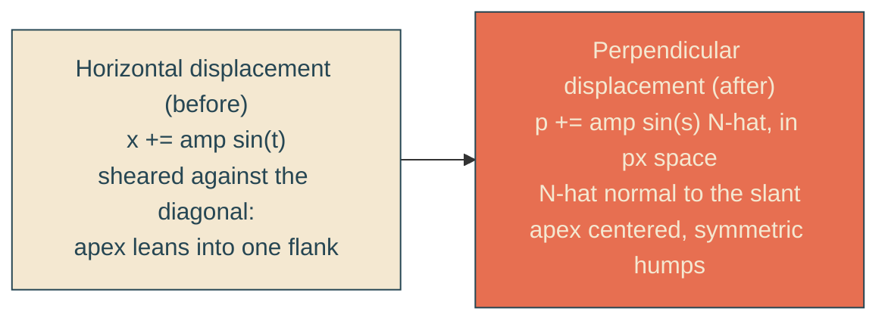

# symmetric-wave-crests

## Verbatim request (2026-06-12)

> the line itself feels very jagged - the max height of the line occurs closer to
> one side of the wave than the other. can we reduce that effect?

## Confirmed understanding

Root cause: the wave displaces the edge horizontally while the edge runs at 45
degrees, so every crest is sheared against the diagonal — the apex leans toward one
zero crossing, reading as jagged. Fix: displace perpendicular to the slant in pixel
space, so crests point straight out of the line with each apex centered between its
crossings. Tuning unchanged (eight periods, 12.5px amplitude, cubic Beziers).
Accepted side effect: the steepest flanks may curl slightly past vertical, which
the clip renders correctly and reads as natural wave character.

## The geometry at a glance

Because the mask box is anisotropic (1280 wide, 287 tall at reference), the normal
must be computed in pixel space and converted back to box fractions per axis; the
generator therefore consumes the full reference geometry.

## Plan

1. `heroScene.ts`: `WAVE_GEOMETRY` merges the reference dims with periods/samples;
   `buildWaveEdgePath` rebuilt in the rotated frame — base point runs along the
   slant, displacement rides the unit normal, Bezier tangents from the analytic
   derivative, both converted px-to-fraction per axis.
2. Unit tests (failure-first), now evaluated in pixel space: anchors advance
   monotonically along the edge direction (replacing monotonic-y, which the
   perpendicular wave legitimately violates on steep flanks); perpendicular
   deviation extrema at exactly plus and minus amplitudePx; eight crests and eight
   troughs; C1 joints; and the new symmetry lock — every apex sits at the midpoint
   of its neighboring zero crossings along the edge, within 5 percent of the
   half-wavelength.
3. Canary/integration: round-trip updates for WAVE_GEOMETRY; path-snippet check
   re-derives.
4. E2E: probe computes perpendicular deviations from rendered px (band 8-18 both
   signs) plus an apex-centering assertion on the rendered path.
5. Validate locally (suites, frames), deploy with the mid-path sentinel, forensics
   pre/post.

### PR checklist pass

Generator stays a single pure function beside its data; no style changes; no
comments; tests cover the fix and the regression it guards against.
